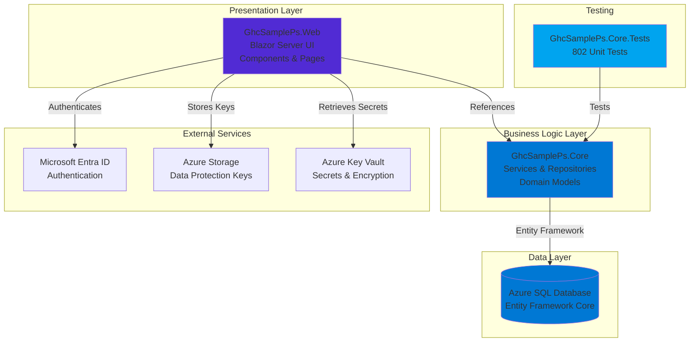

# GhcSamplePs - Soccer Player Statistics Tracker

A modern, cloud-native Blazor Server application for tracking soccer player statistics across teams, seasons, and championships. Built with clean architecture principles and deployed to Azure Container Apps.

[](https://dotnet.microsoft.com/)
[](https://dotnet.microsoft.com/apps/aspnet/web-apps/blazor)
[](https://azure.microsoft.com/products/container-apps)
[](https://mudblazor.com/)
[](LICENSE)

---

## 📋 Table of Contents

- [Overview](#overview)
- [Technology Stack](#technology-stack)
- [Project Architecture](#project-architecture)
- [Key Features](#key-features)
- [Getting Started](#getting-started)
- [Project Structure](#project-structure)
- [Development Workflow](#development-workflow)
- [Coding Standards](#coding-standards)
- [Testing](#testing)
- [Deployment](#deployment)
- [Contributing](#contributing)
- [Documentation](#documentation)

---

## Overview

GhcSamplePs is a Progressive Web Application (PWA) designed to help parents, coaches, and players track soccer player performance across multiple teams and seasons. Built with modern .NET technologies and Azure cloud services, it provides a responsive, mobile-first experience with offline capabilities.

### What This Application Does

- **Player Management** - Track player profiles, dates of birth, photos, and roster history
- **Team Management** - Organize players into teams across different championships and seasons
- **Statistics Tracking** - Record detailed game-level statistics (goals, assists, minutes played, starter status)
- **Performance Analytics** - View aggregated statistics and player performance over time
- **Authentication** - Secure access with Microsoft Entra ID External Identities
- **Mobile-First Design** - Responsive UI with PWA capabilities for mobile devices

### Architecture Highlights

✅ **Clean Architecture** - Strict separation between UI (Web) and business logic (Core)  
✅ **Cloud-Native** - Designed for Azure Container Apps with serverless SQL  
✅ **Passwordless Auth** - Managed Identity for all Azure service connections  
✅ **Cost-Optimized** - Scale-to-zero containers, auto-pausing SQL ($7-35/month dev environment)  
✅ **GDPR Compliant** - Canada Central region, audit logging, encryption at rest/transit  
✅ **Progressive Web App** - Install to home screen, offline support, responsive design

---

## Technology Stack

### Core Technologies

| Technology | Version | Purpose |
|------------|---------|---------|
| **.NET** | 10.0 | Runtime framework and SDK |
| **C#** | 14 | Programming language |
| **Blazor Server** | 10.0 | Interactive web UI with SignalR |
| **Entity Framework Core** | 10.0 | ORM and database migrations |
| **MudBlazor** | 8.x | Material Design component library |

### Azure Services

| Service | Configuration | Purpose |
|---------|--------------|---------|
| **Container Apps** | 0.25 vCPU, 0.5GB RAM | Serverless container hosting |
| **SQL Database** | Serverless (0.5-2 vCores) | Auto-pausing SQL database |
| **Key Vault** | Standard tier | Secrets and key encryption |
| **Storage Account** | Standard LRS | Data Protection keys |
| **Container Registry** | Basic tier | Private Docker images |
| **Application Insights** | Pay-as-you-go | APM and telemetry |

### Authentication & Security

- **Microsoft Entra ID** - External Identities for user authentication
- **Microsoft Identity Web** - OIDC/OAuth 2.0 integration
- **Azure Managed Identity** - Passwordless service-to-service auth
- **Azure Data Protection** - Multi-instance key management

### Infrastructure as Code

- **Bicep** - Azure resource templates
- **PowerShell** - Deployment automation scripts
- **Docker** - Multi-stage containerization

### Testing & Quality

- **xUnit** - Unit testing framework
- **802 tests** - Comprehensive test coverage
- **In-Memory Database** - EF Core testing provider

---

## Project Architecture

### High-Level Architecture



### Clean Architecture Principles

**Dependency Direction:**
```
GhcSamplePs.Web → GhcSamplePs.Core
```

✅ **Web depends on Core** - UI layer calls business logic services  
❌ **Core never depends on Web** - Business logic is UI-agnostic and testable  

**Separation of Concerns:**

| Layer | Responsibilities | Should NOT Contain |
|-------|------------------|-------------------|
| **Web** | UI components, pages, routing, user interactions, display logic | Business rules, data access, complex calculations |
| **Core** | Business logic, services, repositories, domain models, validation | UI components, Blazor code, HTTP context |
| **Tests** | Unit tests for Core services and repositories | UI tests, integration tests with UI |

---

## Key Features

### 1. Player Management

- Create and manage player profiles with personal information
- Upload player photos (future: Azure Blob Storage integration)
- Track player demographics (name, date of birth, gender)
- View complete player history across all teams and seasons

### 2. Team Management

- Organize players into teams
- Track team rosters with join/leave dates
- Manage active/inactive player status
- Associate teams with championships and seasons

### 3. Player Statistics

- Record detailed game-level statistics:
  - Minutes played
  - Goals scored
  - Assists
  - Starter status
  - Jersey number
- Link statistics to specific team-season combinations
- Aggregate statistics by team, season, or career totals

### 4. Authentication & Authorization

- Microsoft Entra ID External Identities integration
- Secure user authentication with OIDC/OAuth 2.0
- Role-based access control (future enhancement)
- Audit logging (CreatedBy, UpdatedBy fields on all entities)

### 5. Progressive Web App (PWA)

- Install to mobile home screen
- Offline support with service workers
- Responsive design for all screen sizes
- Material Design UI with MudBlazor components

### 6. Data Management

- Entity Framework Core migrations
- SQL Server with Managed Identity authentication
- Audit fields on all entities (Created/Updated timestamps and users)
- Soft delete support (future enhancement)

---

## Getting Started

### Prerequisites

Before you begin, ensure you have:

- ✅ [.NET 10 SDK](https://dotnet.microsoft.com/download/dotnet/10.0) installed
- ✅ [Visual Studio 2022](https://visualstudio.microsoft.com/) (17.12+), [VS Code](https://code.visualstudio.com/), or [Rider](https://www.jetbrains.com/rider/)
- ✅ [Docker Desktop](https://www.docker.com/products/docker-desktop) (for containerization)
- ✅ [Azure CLI](https://learn.microsoft.com/cli/azure/install-azure-cli) (for deployment)
- ✅ [Bicep CLI](https://learn.microsoft.com/azure/azure-resource-manager/bicep/install) (for infrastructure)
- ✅ [SQL Server LocalDB](https://learn.microsoft.com/sql/database-engine/configure-windows/sql-server-express-localdb) or Azure SQL access

### Local Development Setup

1. **Clone the repository**

   ```powershell
   git clone https://github.com/ricardocovo/ghc-sample-ps.git
   cd ghc-sample-ps
   ```

2. **Restore dependencies**

   ```powershell
   dotnet restore
   ```

3. **Configure database connection**

   Update `src/GhcSamplePs.Web/appsettings.Development.json`:

   ```json
   {
     "ConnectionStrings": {
       "DefaultConnection": "Server=(localdb)\\mssqllocaldb;Database=GhcSamplePs;Trusted_Connection=True;MultipleActiveResultSets=true"
     }
   }
   ```

4. **Apply database migrations**

   ```powershell
   cd src/GhcSamplePs.Web
   dotnet ef database update --project ../GhcSamplePs.Core
   ```

5. **Configure Entra ID (Optional for authentication)**

   See [docs/Development_Environment_Setup.md](docs/Development_Environment_Setup.md) for complete Entra ID configuration.

6. **Run the application**

   ```powershell
   cd src/GhcSamplePs.Web
   dotnet run
   ```

   Navigate to `https://localhost:5001` in your browser.

### Quick Build & Test

```powershell
# Build entire solution
dotnet build

# Run all tests (802 tests)
dotnet test

# Run with verbose test output
dotnet test --verbosity normal

# Generate test coverage report
dotnet test --collect:"XPlat Code Coverage"
```

---

## Project Structure

```
ghc-sample-ps/
├── .github/                          # GitHub configurations
│   ├── copilot-instructions.md       # AI assistant instructions
│   ├── instructions/                 # Coding standards and architecture
│   │   ├── bicep-code-best-practices.instructions.md
│   │   ├── blazor-architecture.instructions.md
│   │   ├── csharp.instructions.md
│   │   └── dotnet-architecture-good-practices.instructions.md
│   └── prompts/                      # Code generation prompts
│       └── readme-blueprint-generator.prompt.md
│
├── docs/                             # Documentation
│   ├── Azure_EntraID_Setup_Guide.md  # Entra ID configuration
│   ├── Development_Environment_Setup.md
│   ├── Database_Connection_Setup.md
│   ├── Infrastructure_Verification_Checklist.md
│   ├── PERFORMANCE.md                # Performance guidelines
│   ├── playerstats-requirements.md   # Business requirements
│   ├── PWA_Implementation_Summary.md
│   ├── migrations/                   # SQL migration scripts
│   └── specs/                        # Feature specifications
│
├── infra/                            # Infrastructure as Code
│   ├── main.bicep                    # Main orchestration template
│   ├── main.bicepparam               # Parameters file
│   ├── modules/                      # Bicep modules
│   │   ├── containerapp.bicep        # Container Apps configuration
│   │   ├── containerregistry.bicep   # Azure Container Registry
│   │   ├── keyvault.bicep            # Key Vault setup
│   │   ├── monitoring.bicep          # Log Analytics & App Insights
│   │   ├── sql.bicep                 # Azure SQL Database
│   │   └── storage.bicep             # Storage Account
│   ├── scripts/                      # Deployment automation
│   │   ├── deploy-infra.ps1          # Infrastructure deployment
│   │   ├── build-push-image.ps1      # Docker build & push
│   │   └── configure-permissions.ps1 # SQL permissions helper
│   └── README.md                     # Infrastructure documentation
│
├── src/                              # Source code
│   ├── GhcSamplePs.Core/             # Business logic layer
│   │   ├── Models/                   # Domain entities
│   │   │   ├── Identity/             # User and identity models
│   │   │   └── PlayerManagement/     # Player, Team, Statistics
│   │   ├── Services/                 # Business logic services
│   │   │   ├── Interfaces/           # Service contracts
│   │   │   └── Implementations/      # Service implementations
│   │   ├── Repositories/             # Data access layer
│   │   │   ├── Interfaces/           # Repository contracts
│   │   │   └── Implementations/      # EF Core repositories
│   │   ├── Data/                     # DbContext and configurations
│   │   ├── Validation/               # Business validation rules
│   │   ├── Exceptions/               # Custom exceptions
│   │   ├── Extensions/               # Extension methods
│   │   ├── Migrations/               # EF Core migrations
│   │   └── README.md                 # Core project documentation
│   │
│   └── GhcSamplePs.Web/              # UI layer (Blazor Server)
│       ├── Components/               # Blazor components
│       │   ├── Layout/               # Layout components
│       │   ├── Pages/                # Page components
│       │   └── Shared/               # Shared UI components
│       ├── Services/                 # UI-specific services
│       ├── wwwroot/                  # Static assets
│       │   ├── css/                  # Stylesheets
│       │   ├── js/                   # JavaScript files
│       │   ├── manifest.json         # PWA manifest
│       │   └── service-worker.js     # PWA service worker
│       ├── Dockerfile                # Container build definition
│       ├── Program.cs                # Application startup
│       ├── appsettings.json          # Configuration
│       └── README.md                 # Web project documentation
│
├── tests/                            # Test projects
│   └── GhcSamplePs.Core.Tests/       # Unit tests for Core
│       ├── Services/                 # Service tests
│       ├── Repositories/             # Repository tests
│       ├── Models/                   # Model validation tests
│       ├── Integration/              # Integration tests
│       ├── TestHelpers/              # Test utilities
│       └── README.md                 # Test documentation
│
├── .gitignore                        # Git ignore rules
├── global.json                       # .NET SDK version
├── GhcSamplePs.sln                   # Solution file
└── README.md                         # This file
```

### Project Descriptions

| Project | Purpose | Dependencies |
|---------|---------|--------------|
| **GhcSamplePs.Core** | Business logic, services, repositories, domain models | EF Core, Logging abstractions |
| **GhcSamplePs.Web** | Blazor UI, components, pages, authentication | Core, MudBlazor, Microsoft Identity Web |
| **GhcSamplePs.Core.Tests** | Unit tests for Core project | Core, xUnit, EF Core InMemory |

---

## Development Workflow

### Adding New Features

Follow this workflow when adding new features:

1. **Create service interface** in `src/GhcSamplePs.Core/Services/Interfaces/`
2. **Implement service** in `src/GhcSamplePs.Core/Services/Implementations/`
3. **Write unit tests** in `tests/GhcSamplePs.Core.Tests/Services/`
4. **Register service** in `src/GhcSamplePs.Web/Program.cs` using DI
5. **Create Blazor component** in `src/GhcSamplePs.Web/Components/Pages/`
6. **Inject service** into component using `@inject` directive
7. **Update README files** at all affected levels

### Service Layer Pattern

```csharp
// 1. Define interface in Core
public interface IPlayerService
{
    Task<ServiceResult<Player>> CreatePlayerAsync(Player player);
    Task<ServiceResult<IEnumerable<Player>>> GetAllPlayersAsync();
}

// 2. Implement in Core
public class PlayerService : IPlayerService
{
    private readonly IPlayerRepository _repository;
    
    public PlayerService(IPlayerRepository repository)
    {
        _repository = repository;
    }
    
    public async Task<ServiceResult<Player>> CreatePlayerAsync(Player player)
    {
        // Business logic here
        return ServiceResult<Player>.Success(player);
    }
}

// 3. Register in Web/Program.cs
builder.Services.AddScoped<IPlayerService, PlayerService>();

// 4. Inject into Blazor component
@inject IPlayerService PlayerService

@code {
    private async Task CreatePlayer()
    {
        var result = await PlayerService.CreatePlayerAsync(newPlayer);
        if (result.IsSuccess)
        {
            // Update UI
        }
    }
}
```

### Database Migrations

```powershell
# Create new migration
cd src/GhcSamplePs.Core
dotnet ef migrations add MigrationName --startup-project ../GhcSamplePs.Web

# Apply migrations to database
dotnet ef database update --startup-project ../GhcSamplePs.Web

# Remove last migration (if not applied)
dotnet ef migrations remove --startup-project ../GhcSamplePs.Web

# Generate SQL script for production
dotnet ef migrations script --startup-project ../GhcSamplePs.Web --output migration.sql
```

### Branch Strategy

- `main` - Production-ready code
- `develop` - Integration branch for features
- `feature/*` - New features and enhancements
- `bugfix/*` - Bug fixes
- `hotfix/*` - Urgent production fixes

### Commit Messages

Follow conventional commit format:

```
<type>(<scope>): <subject>

<body>

<footer>
```

**Types:**
- `feat:` - New feature
- `fix:` - Bug fix
- `refactor:` - Code refactoring
- `test:` - Adding or updating tests
- `docs:` - Documentation changes
- `chore:` - Maintenance tasks

**Examples:**
```
feat(player): add player statistics tracking
fix(auth): resolve token expiration issue
refactor(core): extract validation to separate service
test(player): add unit tests for PlayerService
docs(readme): update deployment instructions
```

---

## Coding Standards

### C# Conventions

Follow `.github/instructions/csharp.instructions.md` for comprehensive C# standards:

- Use **C# 14** features and modern language constructs
- Apply **PascalCase** for public members, **camelCase** for private fields
- Prefix interfaces with `I` (e.g., `IPlayerService`)
- Use **file-scoped namespaces** and **implicit usings**
- Apply **nullable reference types** throughout
- Use `is null` / `is not null` instead of `== null`
- Add XML documentation for all public APIs

### Blazor Architecture

Follow `.github/instructions/blazor-architecture.instructions.md`:

- ✅ **Keep components small and focused** (single responsibility)
- ✅ **Use `@inject` for service dependencies**
- ✅ **Call Core services** for all business logic
- ✅ **Use component parameters** for input (`[Parameter]`)
- ✅ **Use EventCallback** for output events
- ❌ **NO business logic in `.razor` files**
- ❌ **NO direct database calls from components**

### DDD and Architecture

Follow `.github/instructions/dotnet-architecture-good-practices.instructions.md`:

- Apply **Domain-Driven Design** principles
- Use **Repository pattern** for data access
- Implement **Service Layer** for business logic
- Return **ServiceResult** pattern for operation outcomes
- Apply **validation at service boundaries**
- Use **async/await** for all I/O operations

### Code Quality Rules

- **Write tests first** or alongside implementation (TDD)
- **Keep methods small** - ideally under 20 lines
- **Avoid deep nesting** - maximum 3 levels
- **Use meaningful names** - self-documenting code
- **Handle edge cases** - validate inputs, check nulls
- **Log important operations** - use structured logging
- **Comment complex logic** - explain "why", not "what"

---

## Testing

### Test Strategy

This project follows comprehensive testing practices with **802 unit tests** covering:

- ✅ Service layer business logic
- ✅ Repository data access patterns
- ✅ Domain model validation
- ✅ Exception handling and error cases
- ✅ Edge cases and boundary conditions

### Running Tests

```powershell
# Run all tests
dotnet test

# Run with detailed output
dotnet test --verbosity normal

# Run specific test class
dotnet test --filter "FullyQualifiedName~PlayerServiceTests"

# Run tests in parallel
dotnet test --parallel

# Generate coverage report
dotnet test --collect:"XPlat Code Coverage"
```

### Test Structure

```
tests/GhcSamplePs.Core.Tests/
├── Services/
│   ├── PlayerServiceTests.cs
│   ├── PlayerStatisticServiceTests.cs
│   └── TeamPlayerServiceTests.cs
├── Repositories/
│   ├── PlayerRepositoryTests.cs
│   └── PlayerStatisticRepositoryTests.cs
├── Models/
│   ├── PlayerValidationTests.cs
│   └── TeamPlayerValidationTests.cs
├── Integration/
│   └── DatabaseIntegrationTests.cs
└── TestHelpers/
    ├── TestDataBuilder.cs
    └── InMemoryDbContextFactory.cs
```

### Test Naming Convention

```csharp
// Pattern: WhenCondition_ThenExpectedBehavior
[Fact]
public async Task WhenCreatingPlayerWithValidData_ThenPlayerIsCreated()
{
    // Arrange
    var player = new Player { Name = "John Doe", DateOfBirth = new DateTime(2010, 1, 1) };
    
    // Act
    var result = await _playerService.CreatePlayerAsync(player);
    
    // Assert
    Assert.True(result.IsSuccess);
    Assert.NotNull(result.Data);
}
```

### Testing Best Practices

- Use **xUnit** framework (already configured)
- Mock **external dependencies only** (don't mock Core services)
- Use **EF Core InMemory provider** for repository tests
- Test through **public APIs** only
- Keep tests **independent and isolated**
- Use **test data builders** for complex object setup
- Follow **AAA pattern** (Arrange, Act, Assert)

### Test Coverage Goals

| Component | Target Coverage |
|-----------|----------------|
| Services | 90%+ |
| Repositories | 85%+ |
| Validation | 95%+ |
| Models | 80%+ |

---

## Deployment

### Local Development

See [Getting Started](#getting-started) section for local setup.

### Docker Containerization

The application includes a multi-stage Dockerfile optimized for Azure Container Apps:

```powershell
# Build Docker image
cd src/GhcSamplePs.Web
docker build -t ghcsampleps-web:latest -f Dockerfile ../..

# Run container locally
docker run -p 8080:8080 ghcsampleps-web:latest
```

### Azure Deployment

#### Prerequisites

1. Azure subscription with appropriate permissions
2. Azure CLI installed and authenticated
3. Bicep CLI installed
4. Entra ID application registered (see [docs/Azure_EntraID_Setup_Guide.md](docs/Azure_EntraID_Setup_Guide.md))

#### Infrastructure Deployment

```powershell
# Navigate to infrastructure directory
cd infra

# Login to Azure
az login

# Set subscription (if multiple subscriptions)
az account set --subscription "Your Subscription Name"

# Deploy infrastructure
./scripts/deploy-infra.ps1 `
    -AppName "ghcsampleps" `
    -Environment "dev" `
    -Location "canadacentral" `
    -SubscriptionId "your-subscription-id"
```

#### Application Deployment

```powershell
# Build and push Docker image
./scripts/build-push-image.ps1 `
    -ResourceGroupName "rg-ghcsampleps-dev" `
    -RegistryName "acrghcsamplepsdev" `
    -ImageName "ghcsampleps-web" `
    -ImageTag "1.0.0"

# Container App will automatically pull and deploy the new image
```

#### Post-Deployment Configuration

1. **Configure SQL Permissions**
   ```powershell
   ./scripts/configure-permissions.ps1 `
       -ResourceGroupName "rg-ghcsampleps-dev" `
       -ContainerAppName "ca-ghcsampleps-dev"
   ```

2. **Update Entra ID Redirect URIs**
   - Navigate to Azure Portal → Entra ID → App Registrations
   - Add Container App URL to redirect URIs: `https://your-app.azurecontainerapps.io/signin-oidc`

3. **Verify Deployment**
   ```powershell
   # Get Container App URL
   az containerapp show `
       --name "ca-ghcsampleps-dev" `
       --resource-group "rg-ghcsampleps-dev" `
       --query "properties.configuration.ingress.fqdn" -o tsv
   ```

### Cost Management

**Development Environment:** $7-35/month
- Container Apps: Scale-to-zero (0-1 replicas)
- SQL Database: Serverless (0.5-2 vCores, auto-pause after 1hr)
- Storage: Minimal usage for Data Protection keys
- Key Vault: Standard tier with minimal operations

**Production Environment:** $125-235/month
- Container Apps: 2-5 replicas with higher CPU/memory
- SQL Database: 2-8 vCores without auto-pause
- Enhanced monitoring and diagnostics

See [infra/README.md](infra/README.md) for detailed cost breakdown and optimization strategies.

---

## Contributing

### How to Contribute

1. **Fork the repository**
2. **Create a feature branch** (`git checkout -b feature/amazing-feature`)
3. **Follow coding standards** (see [Coding Standards](#coding-standards))
4. **Write tests** for new functionality
5. **Ensure all tests pass** (`dotnet test`)
6. **Update documentation** (README files at all levels)
7. **Commit changes** using conventional commits
8. **Push to branch** (`git push origin feature/amazing-feature`)
9. **Open a Pull Request**

### Code Review Guidelines

- All code changes require approval
- Tests must pass (802+ tests)
- Code must follow established patterns
- Documentation must be updated
- No business logic in UI layer
- Core project remains UI-agnostic

### Code Exemplars

Reference existing implementations for patterns:

- **Service Implementation:** `src/GhcSamplePs.Core/Services/Implementations/PlayerService.cs`
- **Repository Pattern:** `src/GhcSamplePs.Core/Repositories/Implementations/PlayerRepository.cs`
- **Blazor Component:** `src/GhcSamplePs.Web/Components/Pages/ManagePlayers.razor`
- **Unit Tests:** `tests/GhcSamplePs.Core.Tests/Services/PlayerServiceTests.cs`

---

## Documentation

### Comprehensive Documentation

This project includes extensive documentation:

#### Architecture & Guidelines

- [.github/copilot-instructions.md](.github/copilot-instructions.md) - AI assistant instructions and architecture overview
- [.github/instructions/csharp.instructions.md](.github/instructions/csharp.instructions.md) - C# coding standards
- [.github/instructions/blazor-architecture.instructions.md](.github/instructions/blazor-architecture.instructions.md) - Blazor architecture patterns
- [.github/instructions/dotnet-architecture-good-practices.instructions.md](.github/instructions/dotnet-architecture-good-practices.instructions.md) - DDD principles
- [.github/instructions/bicep-code-best-practices.instructions.md](.github/instructions/bicep-code-best-practices.instructions.md) - Infrastructure best practices

#### Project Documentation

- [src/GhcSamplePs.Core/README.md](src/GhcSamplePs.Core/README.md) - Business logic layer documentation (900+ lines)
- [src/GhcSamplePs.Web/README.md](src/GhcSamplePs.Web/README.md) - UI layer documentation (700+ lines)
- [tests/GhcSamplePs.Core.Tests/README.md](tests/GhcSamplePs.Core.Tests/README.md) - Testing documentation
- [infra/README.md](infra/README.md) - Infrastructure deployment guide (900+ lines)

#### Setup & Configuration

- [docs/Development_Environment_Setup.md](docs/Development_Environment_Setup.md) - Local development setup
- [docs/Azure_EntraID_Setup_Guide.md](docs/Azure_EntraID_Setup_Guide.md) - Entra ID configuration
- [docs/Database_Connection_Setup.md](docs/Database_Connection_Setup.md) - Database configuration
- [docs/Infrastructure_Verification_Checklist.md](docs/Infrastructure_Verification_Checklist.md) - Pre-deployment validation

#### Requirements & Specifications

- [docs/playerstats-requirements.md](docs/playerstats-requirements.md) - Business requirements and entity model
- [docs/specs/PlayerStatistics_Feature_Specification.md](docs/specs/PlayerStatistics_Feature_Specification.md) - Statistics feature spec
- [docs/specs/TeamManagement_Feature_Specification_Concise.md](docs/specs/TeamManagement_Feature_Specification_Concise.md) - Team management spec
- [docs/specs/EFCore_AzureSQL_Repository_Implementation_Specification.md](docs/specs/EFCore_AzureSQL_Repository_Implementation_Specification.md) - Data access spec

#### User Guides

- [docs/Player_Statistics_User_Guide.md](docs/Player_Statistics_User_Guide.md) - Player statistics feature guide
- [docs/Team_Management_User_Guide.md](docs/Team_Management_User_Guide.md) - Team management feature guide
- [docs/PWA_Testing_Guide.md](docs/PWA_Testing_Guide.md) - PWA functionality guide

#### Performance & Operations

- [docs/PERFORMANCE.md](docs/PERFORMANCE.md) - Performance optimization guidelines
- [docs/PWA_Implementation_Summary.md](docs/PWA_Implementation_Summary.md) - PWA implementation details

---

## License

This project is licensed under the MIT License. See [LICENSE](LICENSE) file for details.

---

## Support & Contact

- **Issues:** [GitHub Issues](https://github.com/ricardocovo/ghc-sample-ps/issues)
- **Discussions:** [GitHub Discussions](https://github.com/ricardocovo/ghc-sample-ps/discussions)
- **Documentation:** See [Documentation](#documentation) section above

---

## Acknowledgments

- Built with [.NET 10](https://dotnet.microsoft.com/)
- UI powered by [MudBlazor](https://mudblazor.com/)
- Hosted on [Azure Container Apps](https://azure.microsoft.com/products/container-apps)
- Authentication by [Microsoft Entra ID](https://www.microsoft.com/security/business/identity-access/microsoft-entra-id)
