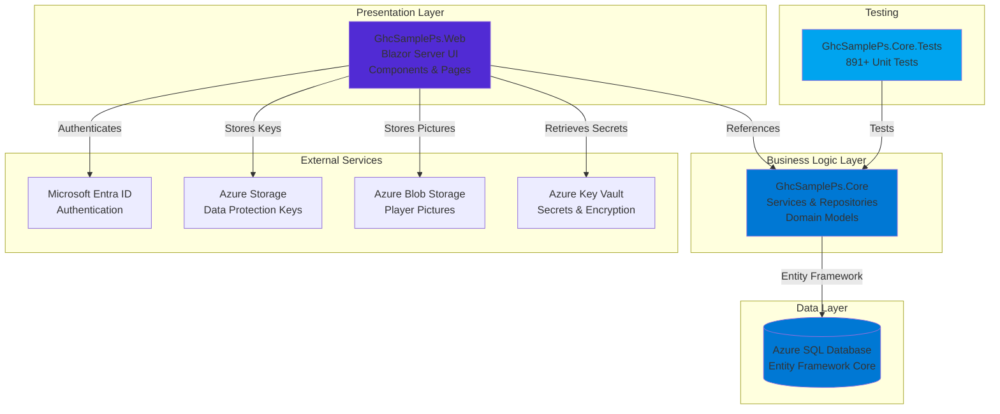
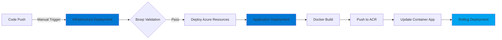

# GhcSamplePs - Soccer Player Statistics Tracker

A modern, cloud-native Blazor Server application for tracking soccer player statistics across teams, seasons, and championships. Built with clean architecture principles and deployed to Azure Container Apps.

[](https://dotnet.microsoft.com/)
[](https://docs.microsoft.com/en-us/dotnet/csharp/)
[](https://dotnet.microsoft.com/apps/aspnet/web-apps/blazor)
[](https://azure.microsoft.com/products/container-apps)
[](https://mudblazor.com/)
[](tests/)
[](tests/)
[](LICENSE)

> 🚀 **Quick Links:** [Getting Started](#getting-started) | [Architecture](#project-architecture) | [Deployment](#deployment) | [Documentation](#documentation) | [Contributing](#contributing)

---

## 📋 Table of Contents

- [Overview](#overview)
- [Technology Stack](#technology-stack)
- [Project Architecture](#project-architecture)
- [Key Features](#key-features)
- [Getting Started](#getting-started)
- [Project Structure](#project-structure)
- [Development Workflow](#development-workflow)
- [Coding Standards](#coding-standards)
- [Testing](#testing)
- [Deployment](#deployment)
- [Contributing](#contributing)
- [Documentation](#documentation)
- [CI/CD](#cicd)
- [License](#license)

---

## Overview

**GhcSamplePs** is a Progressive Web Application (PWA) designed to help parents, coaches, and players track soccer player performance across multiple teams and seasons. Built with modern .NET technologies and Azure cloud services, it demonstrates enterprise-grade architecture patterns and cloud-native development practices.

### What This Application Does

**Core Functionality:**

- **Player Management** - Comprehensive player profile management
  - Track player demographics (name, date of birth, gender)
  - Upload and manage player profile pictures (Azure Blob Storage)
  - File validation (5 MB limit, JPEG/PNG/GIF/WebP formats)
  - Secure picture storage with time-limited SAS token access
  - Delete and re-upload capabilities with immediate preview
  - Complete roster history across all teams and seasons
  
- **Team Management** - Multi-team organization system
  - Organize players into multiple teams simultaneously
  - Track team rosters with precise join/leave dates
  - Manage active/inactive player status per team
  - Associate teams with championships and seasons
  - Historical tracking of player team assignments
  
- **Statistics Tracking** - Detailed game-level analytics
  - Record comprehensive game statistics:
    - Minutes played per game
    - Goals scored and assists
    - Starter vs. substitute status
    - Jersey number assignment
  - Link statistics to specific team-season combinations
  - Aggregate views: team stats, season stats, career totals
  - Performance trending and analytics
  
- **Authentication & Security** - Enterprise-grade security
  - Microsoft Entra ID External Identities integration
  - Secure user authentication with OIDC/OAuth 2.0
  - Role-based access control (extensible)
  - Complete audit logging (CreatedBy, UpdatedBy on all entities)
  - Passwordless authentication with Managed Identity
  
- **Mobile-First Design** - Progressive Web App experience
  - Install to mobile/desktop home screen
  - Offline support with intelligent caching
  - Responsive design for all screen sizes
  - Material Design UI with MudBlazor components
  - Fast, app-like user experience

### Architecture Highlights

✅ **Clean Architecture** - Strict separation between UI (Web) and business logic (Core)
✅ **Cloud-Native** - Designed for Azure Container Apps with serverless SQL
✅ **Passwordless Auth** - Managed Identity for all Azure service connections
✅ **Cost-Optimized** - Scale-to-zero containers, auto-pausing SQL ($7-35/month dev environment)
✅ **GDPR Compliant** - Canada Central region, audit logging, encryption at rest/transit
✅ **Progressive Web App** - Install to home screen, offline support, responsive design

---

## Technology Stack

### Core Technologies

| Technology | Version | Purpose |
|------------|---------|---------|
| **.NET** | 10.0 | Runtime framework and SDK |
| **C#** | 14 | Programming language |
| **Blazor Server** | 10.0 | Interactive web UI with SignalR |
| **Entity Framework Core** | 10.0 | ORM and database migrations |
| **MudBlazor** | 8.x | Material Design component library |

### Azure Services

| Service | Configuration | Purpose |
|---------|--------------|---------|
| **Container Apps** | 0.25 vCPU, 0.5GB RAM | Serverless container hosting |
| **SQL Database** | Serverless (0.5-2 vCores) | Auto-pausing SQL database |
| **Key Vault** | Standard tier | Secrets and key encryption |
| **Storage Account** | Standard LRS | Data Protection keys & player pictures |
| **Blob Storage** | player-pictures container | Player profile picture storage |
| **Container Registry** | Basic tier | Private Docker images |
| **Application Insights** | Pay-as-you-go | APM and telemetry |

### Authentication & Security

- **Microsoft Entra ID** - External Identities for user authentication
- **Microsoft Identity Web** - OIDC/OAuth 2.0 integration
- **Azure Managed Identity** - Passwordless service-to-service auth
- **Azure Data Protection** - Multi-instance key management

### Infrastructure as Code

- **Bicep** - Azure resource templates
- **PowerShell** - Deployment automation scripts
- **Docker** - Multi-stage containerization

### Testing & Quality

- **xUnit** - Unit testing framework
- **891+ tests** - Comprehensive test coverage (57+ picture-related tests)
- **In-Memory Database** - EF Core testing provider
- **85%+ Code Coverage** - Business logic thoroughly tested
- **Moq** - Mocking framework for dependencies

---

## Project Architecture

### High-Level Architecture


```mermaid
graph TB
    subgraph "Presentation Layer"
        Web[GhcSamplePs.Web<br/>Blazor Server UI<br/>Components & Pages]
    end

    subgraph "Business Logic Layer"
        Core[GhcSamplePs.Core<br/>Services & Repositories<br/>Domain Models]
    end

    subgraph "Data Layer"
        DB[(Azure SQL Database<br/>Entity Framework Core)]
    end

    subgraph "External Services"
        EntraID[Microsoft Entra ID<br/>Authentication]
        Storage[Azure Storage<br/>Data Protection Keys]
        BlobStorage[Azure Blob Storage<br/>Player Pictures]
        KV[Azure Key Vault<br/>Secrets & Encryption]
    end

    subgraph "Testing"
        Tests[GhcSamplePs.Core.Tests<br/>891+ Unit Tests]
    end

    Web -->|References| Core
    Core -->|Entity Framework| DB
    Web -->|Authenticates| EntraID
    Web -->|Stores Keys| Storage
    Web -->|Stores Pictures| BlobStorage
    Web -->|Retrieves Secrets| KV
    Tests -->|Tests| Core

    style Web fill:#512BD4
    style Core fill:#0078D4
    style DB fill:#0078D4
    style Tests fill:#00A4EF
```

### Clean Architecture Principles

**Dependency Direction:**
```
GhcSamplePs.Web → GhcSamplePs.Core
```

✅ **Web depends on Core** - UI layer calls business logic services
❌ **Core never depends on Web** - Business logic is UI-agnostic and testable

**Separation of Concerns:**

| Layer | Responsibilities | Should NOT Contain |
|-------|------------------|-------------------|
| **Web** | UI components, pages, routing, user interactions, display logic | Business rules, data access, complex calculations |
| **Core** | Business logic, services, repositories, domain models, validation | UI components, Blazor code, HTTP context |
| **Tests** | Unit tests for Core services and repositories | UI tests, integration tests with UI |

---

## Key Features

### 1. Player Management

- Create and manage player profiles with personal information
- Upload and manage player pictures
  - Support for JPEG, PNG, GIF, and WebP formats
  - 5 MB maximum file size
  - Secure storage in Azure Blob Storage
  - Delete and re-upload capabilities
  - Immediate preview after upload
- Track player demographics (name, date of birth, gender)
- View complete player history across all teams and seasons

### 2. Team Management

- Organize players into teams
- Track team rosters with join/leave dates
- Manage active/inactive player status
- Associate teams with championships and seasons

### 3. Player Statistics

- Record detailed game-level statistics:
  - Minutes played
  - Goals scored
  - Assists
  - Starter status
  - Jersey number
- Link statistics to specific team-season combinations
- Aggregate statistics by team, season, or career totals

### 4. Authentication & Authorization

- Microsoft Entra ID External Identities integration
- Secure user authentication with OIDC/OAuth 2.0
- Role-based access control (future enhancement)
- Audit logging (CreatedBy, UpdatedBy fields on all entities)

### 5. Progressive Web App (PWA)

**Installation & Offline Support:**
- **Installable:** Add to mobile/desktop home screen like a native app
- **Offline Support:** Service worker caches critical resources
- **Background Sync:** Queue data operations when offline
- **Push Notifications:** (Future enhancement)

**Responsive Design:**
- **Mobile-First:** Optimized for touch and small screens
- **Tablet Support:** Adaptive layout for medium screens
- **Desktop Experience:** Full-featured desktop interface
- **Material Design:** MudBlazor component library

**PWA Features:**
- `manifest.json` - App metadata and icons
- `service-worker.js` - Offline caching and sync
- Installable on iOS, Android, Windows, macOS, Linux
- Fast loading with cached assets
- Works in low or no connectivity scenarios

**Testing PWA:**
See [docs/PWA_Testing_Guide.md](docs/PWA_Testing_Guide.md) for comprehensive PWA testing instructions.

### 6. Data Management

- Entity Framework Core migrations
- SQL Server with Managed Identity authentication
- Audit fields on all entities (Created/Updated timestamps and users)
- Soft delete support (future enhancement)

---

## Getting Started

### Prerequisites

Before you begin, ensure you have:

- ✅ [.NET 10 SDK](https://dotnet.microsoft.com/download/dotnet/10.0) installed
- ✅ [Visual Studio 2022](https://visualstudio.microsoft.com/) (17.12+), [VS Code](https://code.visualstudio.com/), or [Rider](https://www.jetbrains.com/rider/)
- ✅ [Docker Desktop](https://www.docker.com/products/docker-desktop) (for containerization)
- ✅ [Azure CLI](https://learn.microsoft.com/cli/azure/install-azure-cli) (for deployment)
- ✅ [Bicep CLI](https://learn.microsoft.com/azure/azure-resource-manager/bicep/install) (for infrastructure)
- ✅ [SQL Server LocalDB](https://learn.microsoft.com/sql/database-engine/configure-windows/sql-server-express-localdb) or Azure SQL access

### Local Development Setup

1. **Clone the repository**

   ```powershell
   git clone https://github.com/ricardocovo/ghc-sample-ps.git
   cd ghc-sample-ps
   ```

2. **Restore dependencies**

   ```powershell
   dotnet restore
   ```

3. **Configure database connection**

   Update `src/GhcSamplePs.Web/appsettings.Development.json`:

   ```json
   {
     "ConnectionStrings": {
       "DefaultConnection": "Server=(localdb)\\mssqllocaldb;Database=GhcSamplePs;Trusted_Connection=True;MultipleActiveResultSets=true"
     }
   }
   ```

4. **Apply database migrations**

   ```powershell
   cd src/GhcSamplePs.Web
   dotnet ef database update --project ../GhcSamplePs.Core
   ```

5. **Configure Entra ID (Optional for authentication)**

   See [docs/Development_Environment_Setup.md](docs/Development_Environment_Setup.md) for complete Entra ID configuration.

6. **Run the application**

   ```powershell
   cd src/GhcSamplePs.Web
   dotnet run
   ```

   Navigate to `https://localhost:5001` in your browser.

### Quick Build & Test

```powershell
# Build entire solution
dotnet build

# Run all tests (891+ tests)
dotnet test

# Run with verbose test output
dotnet test --verbosity normal

# Generate test coverage report
dotnet test --collect:"XPlat Code Coverage"
```

---

## Project Structure

```
ghc-sample-ps/
├── .github/                          # GitHub configurations
│   ├── copilot-instructions.md       # AI assistant instructions
│   ├── instructions/                 # Coding standards and architecture
│   │   ├── bicep-code-best-practices.instructions.md
│   │   ├── blazor-architecture.instructions.md
│   │   ├── csharp.instructions.md
│   │   └── dotnet-architecture-good-practices.instructions.md
│   └── prompts/                      # Code generation prompts
│       └── readme-blueprint-generator.prompt.md
│
├── docs/                             # Documentation
│   ├── Azure_EntraID_Setup_Guide.md  # Entra ID configuration
│   ├── Development_Environment_Setup.md
│   ├── Database_Connection_Setup.md
│   ├── Infrastructure_Verification_Checklist.md
│   ├── PERFORMANCE.md                # Performance guidelines
│   ├── playerstats-requirements.md   # Business requirements
│   ├── PWA_Implementation_Summary.md
│   ├── migrations/                   # SQL migration scripts
│   └── specs/                        # Feature specifications
│
├── infra/                            # Infrastructure as Code
│   ├── main.bicep                    # Main orchestration template
│   ├── main.bicepparam               # Parameters file
│   ├── modules/                      # Bicep modules
│   │   ├── containerapp.bicep        # Container Apps configuration
│   │   ├── containerregistry.bicep   # Azure Container Registry
│   │   ├── keyvault.bicep            # Key Vault setup
│   │   ├── monitoring.bicep          # Log Analytics & App Insights
│   │   ├── sql.bicep                 # Azure SQL Database
│   │   └── storage.bicep             # Storage Account
│   ├── scripts/                      # Deployment automation
│   │   ├── deploy-infra.ps1          # Infrastructure deployment
│   │   ├── build-push-image.ps1      # Docker build & push
│   │   └── configure-permissions.ps1 # SQL permissions helper
│   └── README.md                     # Infrastructure documentation
│
├── src/                              # Source code
│   ├── GhcSamplePs.Core/             # Business logic layer
│   │   ├── Models/                   # Domain entities
│   │   │   ├── Identity/             # User and identity models
│   │   │   └── PlayerManagement/     # Player, Team, Statistics
│   │   ├── Services/                 # Business logic services
│   │   │   ├── Interfaces/           # Service contracts
│   │   │   └── Implementations/      # Service implementations
│   │   ├── Repositories/             # Data access layer
│   │   │   ├── Interfaces/           # Repository contracts
│   │   │   └── Implementations/      # EF Core repositories
│   │   ├── Data/                     # DbContext and configurations
│   │   ├── Validation/               # Business validation rules
│   │   ├── Exceptions/               # Custom exceptions
│   │   ├── Extensions/               # Extension methods
│   │   ├── Migrations/               # EF Core migrations
│   │   └── README.md                 # Core project documentation
│   │
│   └── GhcSamplePs.Web/              # UI layer (Blazor Server)
│       ├── Components/               # Blazor components
│       │   ├── Layout/               # Layout components
│       │   ├── Pages/                # Page components
│       │   └── Shared/               # Shared UI components
│       ├── Services/                 # UI-specific services
│       ├── wwwroot/                  # Static assets
│       │   ├── css/                  # Stylesheets
│       │   ├── js/                   # JavaScript files
│       │   ├── manifest.json         # PWA manifest
│       │   └── service-worker.js     # PWA service worker
│       ├── Dockerfile                # Container build definition
│       ├── Program.cs                # Application startup
│       ├── appsettings.json          # Configuration
│       └── README.md                 # Web project documentation
│
├── tests/                            # Test projects
│   └── GhcSamplePs.Core.Tests/       # Unit tests for Core
│       ├── Services/                 # Service tests
│       ├── Repositories/             # Repository tests
│       ├── Models/                   # Model validation tests
│       ├── Integration/              # Integration tests
│       ├── TestHelpers/              # Test utilities
│       └── README.md                 # Test documentation
│
├── .gitignore                        # Git ignore rules
├── global.json                       # .NET SDK version
├── GhcSamplePs.sln                   # Solution file
└── README.md                         # This file
```

### Project Descriptions

| Project | Purpose | Dependencies |
|---------|---------|--------------|
| **GhcSamplePs.Core** | Business logic, services, repositories, domain models | EF Core, Logging abstractions |
| **GhcSamplePs.Web** | Blazor UI, components, pages, authentication | Core, MudBlazor, Microsoft Identity Web |
| **GhcSamplePs.Core.Tests** | Unit tests for Core project | Core, xUnit, EF Core InMemory |

---

## Development Workflow

### Adding New Features

Follow this workflow when adding new features:

1. **Create service interface** in `src/GhcSamplePs.Core/Services/Interfaces/`
2. **Implement service** in `src/GhcSamplePs.Core/Services/Implementations/`
3. **Write unit tests** in `tests/GhcSamplePs.Core.Tests/Services/`
4. **Register service** in `src/GhcSamplePs.Web/Program.cs` using DI
5. **Create Blazor component** in `src/GhcSamplePs.Web/Components/Pages/`
6. **Inject service** into component using `@inject` directive
7. **Update README files** at all affected levels

### Service Layer Pattern

```csharp
// 1. Define interface in Core
public interface IPlayerService
{
    Task<ServiceResult<Player>> CreatePlayerAsync(Player player);
    Task<ServiceResult<IEnumerable<Player>>> GetAllPlayersAsync();
}

// 2. Implement in Core
public class PlayerService : IPlayerService
{
    private readonly IPlayerRepository _repository;

    public PlayerService(IPlayerRepository repository)
    {
        _repository = repository;
    }

    public async Task<ServiceResult<Player>> CreatePlayerAsync(Player player)
    {
        // Business logic here
        return ServiceResult<Player>.Success(player);
    }
}

// 3. Register in Web/Program.cs
builder.Services.AddScoped<IPlayerService, PlayerService>();

// 4. Inject into Blazor component
@inject IPlayerService PlayerService

@code {
    private async Task CreatePlayer()
    {
        var result = await PlayerService.CreatePlayerAsync(newPlayer);
        if (result.IsSuccess)
        {
            // Update UI
        }
    }
}
```

### Database Migrations

```powershell
# Create new migration
cd src/GhcSamplePs.Core
dotnet ef migrations add MigrationName --startup-project ../GhcSamplePs.Web

# Apply migrations to database
dotnet ef database update --startup-project ../GhcSamplePs.Web

# Remove last migration (if not applied)
dotnet ef migrations remove --startup-project ../GhcSamplePs.Web

# Generate SQL script for production
dotnet ef migrations script --startup-project ../GhcSamplePs.Web --output migration.sql
```

### Branch Strategy

- `main` - Production-ready code
- `develop` - Integration branch for features
- `feature/*` - New features and enhancements
- `bugfix/*` - Bug fixes
- `hotfix/*` - Urgent production fixes

### Commit Messages

Follow conventional commit format:

```
<type>(<scope>): <subject>

<body>

<footer>
```

**Types:**
- `feat:` - New feature
- `fix:` - Bug fix
- `refactor:` - Code refactoring
- `test:` - Adding or updating tests
- `docs:` - Documentation changes
- `chore:` - Maintenance tasks

**Examples:**
```
feat(player): add player statistics tracking
fix(auth): resolve token expiration issue
refactor(core): extract validation to separate service
test(player): add unit tests for PlayerService
docs(readme): update deployment instructions
```

---

## Coding Standards

### C# Conventions

Follow `.github/instructions/csharp.instructions.md` for comprehensive C# standards:

- Use **C# 14** features and modern language constructs
- Apply **PascalCase** for public members, **camelCase** for private fields
- Prefix interfaces with `I` (e.g., `IPlayerService`)
- Use **file-scoped namespaces** and **implicit usings**
- Apply **nullable reference types** throughout
- Use `is null` / `is not null` instead of `== null`
- Add XML documentation for all public APIs

### Blazor Architecture

Follow `.github/instructions/blazor-architecture.instructions.md`:

- ✅ **Keep components small and focused** (single responsibility)
- ✅ **Use `@inject` for service dependencies**
- ✅ **Call Core services** for all business logic
- ✅ **Use component parameters** for input (`[Parameter]`)
- ✅ **Use EventCallback** for output events
- ❌ **NO business logic in `.razor` files**
- ❌ **NO direct database calls from components**

### DDD and Architecture

Follow `.github/instructions/dotnet-architecture-good-practices.instructions.md`:

- Apply **Domain-Driven Design** principles
- Use **Repository pattern** for data access
- Implement **Service Layer** for business logic
- Return **ServiceResult** pattern for operation outcomes
- Apply **validation at service boundaries**
- Use **async/await** for all I/O operations

### Code Quality Rules

- **Write tests first** or alongside implementation (TDD)
- **Keep methods small** - ideally under 20 lines
- **Avoid deep nesting** - maximum 3 levels
- **Use meaningful names** - self-documenting code
- **Handle edge cases** - validate inputs, check nulls
- **Log important operations** - use structured logging
- **Comment complex logic** - explain "why", not "what"

---

## Testing

### Test Strategy

This project follows comprehensive testing practices with **891+ unit tests** covering:

- ✅ Service layer business logic
- ✅ Repository data access patterns
- ✅ Domain model validation
- ✅ Exception handling and error cases
- ✅ Edge cases and boundary conditions

### Running Tests

```powershell
# Run all tests
dotnet test

# Run with detailed output
dotnet test --verbosity normal

# Run specific test class
dotnet test --filter "FullyQualifiedName~PlayerServiceTests"

# Run tests in parallel
dotnet test --parallel

# Generate coverage report
dotnet test --collect:"XPlat Code Coverage"
```

### Test Structure

```
tests/GhcSamplePs.Core.Tests/
├── Services/
│   ├── PlayerServiceTests.cs
│   ├── PlayerStatisticServiceTests.cs
│   └── TeamPlayerServiceTests.cs
├── Repositories/
│   ├── PlayerRepositoryTests.cs
│   └── PlayerStatisticRepositoryTests.cs
├── Models/
│   ├── PlayerValidationTests.cs
│   └── TeamPlayerValidationTests.cs
├── Integration/
│   └── DatabaseIntegrationTests.cs
└── TestHelpers/
    ├── TestDataBuilder.cs
    └── InMemoryDbContextFactory.cs
```

### Test Naming Convention

```csharp
// Pattern: WhenCondition_ThenExpectedBehavior
[Fact]
public async Task WhenCreatingPlayerWithValidData_ThenPlayerIsCreated()
{
    // Arrange
    var player = new Player { Name = "John Doe", DateOfBirth = new DateTime(2010, 1, 1) };

    // Act
    var result = await _playerService.CreatePlayerAsync(player);

    // Assert
    Assert.True(result.IsSuccess);
    Assert.NotNull(result.Data);
}
```

### Testing Best Practices

- Use **xUnit** framework (already configured)
- Mock **external dependencies only** (don't mock Core services)
- Use **EF Core InMemory provider** for repository tests
- Test through **public APIs** only
- Keep tests **independent and isolated**
- Use **test data builders** for complex object setup
- Follow **AAA pattern** (Arrange, Act, Assert)

### Test Coverage Goals

| Component | Target Coverage |
|-----------|----------------|
| Services | 90%+ |
| Repositories | 85%+ |
| Validation | 95%+ |
| Models | 80%+ |

---

## Deployment

### Deployment Options

This project supports multiple deployment methods:

1. **GitHub Actions** (Recommended) - Automated deployment workflows
2. **PowerShell Scripts** - Manual deployment with scripts
3. **Azure CLI** - Direct command-line deployment
4. **Local Docker** - Containerized local development

### Option 1: GitHub Actions Deployment (Recommended)

The easiest way to deploy is using the built-in GitHub Actions workflows.

**Prerequisites:**
- GitHub repository with proper secrets configured (see [CI/CD](#cicd) section)
- Azure subscription with appropriate permissions
- Entra ID application registered

**Steps:**

1. **Deploy Infrastructure First**
   - Navigate to: Actions → Deploy Infrastructure
   - Click "Run workflow"
   - Select environment (`dev` or `prod`)
   - Wait for completion (~5-10 minutes)

2. **Deploy Application**
   - Navigate to: Actions → Deploy Application
   - Click "Run workflow"
   - Select environment and image tag
   - Wait for completion (~3-5 minutes)

3. **Verify Deployment**
   - Check workflow logs for Container App URL
   - Navigate to URL and test application
   - Update Entra ID redirect URIs if needed

See [CI/CD](#cicd) section for detailed workflow documentation.

### Option 2: Local Development

See [Getting Started](#getting-started) section for local setup instructions.

### Option 3: Docker Containerization

The application includes a multi-stage Dockerfile optimized for Azure Container Apps:

```powershell
# Build Docker image
cd src/GhcSamplePs.Web
docker build -t ghcsampleps-web:latest -f Dockerfile ../..

# Run container locally
docker run -p 8080:8080 ghcsampleps-web:latest

# Test locally at http://localhost:8080
```

**Dockerfile Highlights:**
- Multi-stage build for optimized image size
- Non-root user for security
- Exposed on port 8080 (Container Apps standard)
- Based on .NET 10 runtime

### Option 4: Manual Azure Deployment with PowerShell

#### Prerequisites

1. Azure subscription with appropriate permissions
2. Azure CLI installed and authenticated
3. Bicep CLI installed
4. Entra ID application registered (see [docs/Azure_EntraID_Setup_Guide.md](docs/Azure_EntraID_Setup_Guide.md))

#### Infrastructure Deployment

```powershell
# Navigate to infrastructure directory
cd infra

# Login to Azure
az login

# Set subscription (if multiple subscriptions)
az account set --subscription "Your Subscription Name"

# Deploy infrastructure
./scripts/deploy-infra.ps1 `
    -AppName "ghcsampleps" `
    -Environment "dev" `
    -Location "canadacentral" `
    -SubscriptionId "your-subscription-id"
```

#### Application Deployment

```powershell
# Build and push Docker image
./scripts/build-push-image.ps1 `
    -ResourceGroupName "rg-ghcsampleps-dev" `
    -RegistryName "acrghcsamplepsdev" `
    -ImageName "ghcsampleps-web" `
    -ImageTag "1.0.0"

# Container App will automatically pull and deploy the new image
```

#### Post-Deployment Configuration

1. **Configure SQL Permissions**
   ```powershell
   ./scripts/configure-permissions.ps1 `
       -ResourceGroupName "rg-ghcsampleps-dev" `
       -ContainerAppName "ca-ghcsampleps-dev"
   ```

2. **Update Entra ID Redirect URIs**
   - Navigate to Azure Portal → Entra ID → App Registrations
   - Add Container App URL to redirect URIs: `https://your-app.azurecontainerapps.io/signin-oidc`

3. **Verify Deployment**
   ```powershell
   # Get Container App URL
   az containerapp show `
       --name "ca-ghcsampleps-dev" `
       --resource-group "rg-ghcsampleps-dev" `
       --query "properties.configuration.ingress.fqdn" -o tsv
   ```

### Cost Management

**Development Environment:** $7-35/month
- Container Apps: Scale-to-zero (0-1 replicas)
- SQL Database: Serverless (0.5-2 vCores, auto-pause after 1hr)
- Storage: Minimal usage for Data Protection keys
- Key Vault: Standard tier with minimal operations

**Production Environment:** $125-235/month
- Container Apps: 2-5 replicas with higher CPU/memory
- SQL Database: 2-8 vCores without auto-pause
- Enhanced monitoring and diagnostics

See [infra/README.md](infra/README.md) for detailed cost breakdown and optimization strategies.

---

## Contributing

### How to Contribute

1. **Fork the repository**
2. **Create a feature branch** (`git checkout -b feature/amazing-feature`)
3. **Follow coding standards** (see [Coding Standards](#coding-standards))
4. **Write tests** for new functionality
5. **Ensure all tests pass** (`dotnet test`)
6. **Update documentation** (README files at all levels)
7. **Commit changes** using conventional commits
8. **Push to branch** (`git push origin feature/amazing-feature`)
9. **Open a Pull Request**

### Code Review Guidelines

- All code changes require approval
- Tests must pass (891+ tests)
- Code must follow established patterns
- Documentation must be updated
- No business logic in UI layer
- Core project remains UI-agnostic

### Code Exemplars

Reference existing implementations for patterns:

- **Service Implementation:** `src/GhcSamplePs.Core/Services/Implementations/PlayerService.cs`
- **Repository Pattern:** `src/GhcSamplePs.Core/Repositories/Implementations/PlayerRepository.cs`
- **Blazor Component:** `src/GhcSamplePs.Web/Components/Pages/ManagePlayers.razor`
- **Unit Tests:** `tests/GhcSamplePs.Core.Tests/Services/PlayerServiceTests.cs`

---

## Documentation

### Comprehensive Documentation

This project includes extensive documentation:

#### Architecture & Guidelines

- [.github/copilot-instructions.md](.github/copilot-instructions.md) - AI assistant instructions and architecture overview
- [.github/instructions/csharp.instructions.md](.github/instructions/csharp.instructions.md) - C# coding standards
- [.github/instructions/blazor-architecture.instructions.md](.github/instructions/blazor-architecture.instructions.md) - Blazor architecture patterns
- [.github/instructions/dotnet-architecture-good-practices.instructions.md](.github/instructions/dotnet-architecture-good-practices.instructions.md) - DDD principles
- [.github/instructions/bicep-code-best-practices.instructions.md](.github/instructions/bicep-code-best-practices.instructions.md) - Infrastructure best practices

#### Project Documentation

- [src/GhcSamplePs.Core/README.md](src/GhcSamplePs.Core/README.md) - Business logic layer documentation (900+ lines)
- [src/GhcSamplePs.Web/README.md](src/GhcSamplePs.Web/README.md) - UI layer documentation (700+ lines)
- [tests/GhcSamplePs.Core.Tests/README.md](tests/GhcSamplePs.Core.Tests/README.md) - Testing documentation
- [infra/README.md](infra/README.md) - Infrastructure deployment guide (900+ lines)

#### Setup & Configuration

- [docs/Development_Environment_Setup.md](docs/Development_Environment_Setup.md) - Local development setup
- [docs/Azure_EntraID_Setup_Guide.md](docs/Azure_EntraID_Setup_Guide.md) - Entra ID configuration
- [docs/Database_Connection_Setup.md](docs/Database_Connection_Setup.md) - Database configuration
- [docs/Infrastructure_Verification_Checklist.md](docs/Infrastructure_Verification_Checklist.md) - Pre-deployment validation

#### Requirements & Specifications

- [docs/playerstats-requirements.md](docs/playerstats-requirements.md) - Business requirements and entity model
- [docs/specs/PlayerStatistics_Feature_Specification.md](docs/specs/PlayerStatistics_Feature_Specification.md) - Statistics feature spec
- [docs/specs/TeamManagement_Feature_Specification_Concise.md](docs/specs/TeamManagement_Feature_Specification_Concise.md) - Team management spec
- [docs/specs/EFCore_AzureSQL_Repository_Implementation_Specification.md](docs/specs/EFCore_AzureSQL_Repository_Implementation_Specification.md) - Data access spec

#### User Guides

- [docs/Player_Statistics_User_Guide.md](docs/Player_Statistics_User_Guide.md) - Player statistics feature guide
- [docs/Team_Management_User_Guide.md](docs/Team_Management_User_Guide.md) - Team management feature guide
- [docs/PWA_Testing_Guide.md](docs/PWA_Testing_Guide.md) - PWA functionality guide

#### Performance & Operations

- [docs/PERFORMANCE.md](docs/PERFORMANCE.md) - Performance optimization guidelines
- [docs/PWA_Implementation_Summary.md](docs/PWA_Implementation_Summary.md) - PWA implementation details

---

## CI/CD

This project uses **GitHub Actions** for automated deployment and quality checks.

### Available Workflows

#### 1. Infrastructure Deployment (`.github/workflows/deploy-infrastructure.yml`)

Deploys Azure infrastructure using Bicep templates.

**Trigger:** Manual (workflow_dispatch)

**Parameters:**
- `environment`: Choose between `dev` or `prod`

**What it does:**
- Validates Bicep templates
- Creates/updates resource group
- Deploys all Azure resources (Container Apps, SQL, Storage, Key Vault, etc.)
- Uses OIDC authentication (passwordless)

**Usage:**
```bash
# Via GitHub UI: Actions → Deploy Infrastructure → Run workflow → Select environment
```

#### 2. Application Deployment (`.github/workflows/deploy-application.yml`)

Builds Docker image and deploys to Azure Container Apps.

**Trigger:** Manual (workflow_dispatch)

**Parameters:**
- `environment`: Choose between `dev` or `prod`
- `image_tag`: Docker image tag (default: latest)

**What it does:**
- Builds multi-stage Docker image
- Pushes to Azure Container Registry
- Updates Container App with new image
- Automatic rolling deployment

**Usage:**
```bash
# Via GitHub UI: Actions → Deploy Application → Run workflow
```

#### 3. Security Reporter (`.github/workflows/security-reporter.yml`)

Analyzes code for security vulnerabilities.

**Trigger:** Manual (workflow_dispatch)

**What it does:**
- Scans TypeScript and C# code for security issues
- Generates security report
- Uploads report as artifact (30-day retention)

#### 4. Documentation Reporter (`.github/workflows/documentation-reporter.yml`)

Validates project documentation completeness.

**Trigger:** Manual (workflow_dispatch)

**What it does:**
- Audits README files across the project
- Checks documentation quality and completeness
- Generates documentation report
- Uploads report as artifact (30-day retention)

### Deployment Pipeline


```mermaid
graph LR
    A[Code Push] -->|Manual Trigger| B[Infrastructure Deployment]
    B --> C{Bicep Validation}
    C -->|Pass| D[Deploy Azure Resources]
    D --> E[Application Deployment]
    E --> F[Docker Build]
    F --> G[Push to ACR]
    G --> H[Update Container App]
    H --> I[Rolling Deployment]
    
    style B fill:#0078D4
    style E fill:#0078D4
    style I fill:#00A4EF
```

### Required GitHub Secrets

Configure these secrets in your GitHub repository (Settings → Secrets and variables → Actions):

**For Infrastructure Deployment:**
- `AZURE_CLIENT_ID` - Service Principal client ID
- `AZURE_TENANT_ID` - Azure tenant ID
- `AZURE_SUBSCRIPTION_ID` - Azure subscription ID
- `SQL_ADMIN_ENTRA_ID` - Entra ID admin username for SQL
- `SQL_ADMIN_OBJECT_ID` - Entra ID admin object ID
- `ENTRA_ID_CLIENT_ID` - Application (client) ID
- `ENTRA_ID_TENANT_ID` - Directory (tenant) ID

**For Application Deployment:**
- All infrastructure secrets (above)
- `REGISTRY_LOGIN_SERVER` - ACR login server URL
- `REGISTRY_USERNAME` - ACR username
- `REGISTRY_PASSWORD` - ACR password

### Continuous Integration Best Practices

While this project uses manual deployment workflows, consider these practices for CI:

1. **Automated Testing:** Run `dotnet test` on every pull request
2. **Code Coverage:** Generate coverage reports and track trends
3. **Static Analysis:** Use tools like SonarQube or CodeQL
4. **Docker Image Scanning:** Scan images for vulnerabilities before deployment
5. **Database Migrations:** Automate EF Core migrations in deployment pipeline

**Example CI workflow (not included):**
```yaml
name: CI
on: [push, pull_request]
jobs:
  test:
    runs-on: ubuntu-latest
    steps:
      - uses: actions/checkout@v4
      - name: Setup .NET
        uses: actions/setup-dotnet@v4
        with:
          dotnet-version: '10.0.x'
      - name: Restore dependencies
        run: dotnet restore
      - name: Build
        run: dotnet build --no-restore
      - name: Test
        run: dotnet test --no-build --verbosity normal
```

---

## License

This project is licensed under the MIT License. See [LICENSE](LICENSE) file for details.

---

## Support & Contact

- **Issues:** [GitHub Issues](https://github.com/ricardocovo/ghc-sample-ps/issues)
- **Discussions:** [GitHub Discussions](https://github.com/ricardocovo/ghc-sample-ps/discussions)
- **Documentation:** See [Documentation](#documentation) section above

---

## Recent Fixes & Updates

### December 29, 2025 - DbContext Threading Fix

**Issue Resolved:** Fixed "A second operation was started on this context instance before a previous operation completed" error in Blazor Server.

**Root Cause:**
- EF Core `QuerySplittingBehavior.SplitQuery` was enabled, causing `.Include()` statements to execute as multiple SQL queries
- Blazor Server components rendering concurrently (pre-rendering + normal rendering) triggered simultaneous access to the same DbContext instance
- This violated EF Core's threading safety requirements

**Solution Applied:**
1. Changed EF Core query splitting from `SplitQuery` to `SingleQuery` in `ServiceCollectionExtensions.cs`
2. Converted parallel `Task.WhenAll` operations to sequential execution in Home.razor
3. Added proper null checks for navigation properties in LINQ queries

**Impact:**
- ✅ Eliminated DbContext threading exceptions
- ✅ Statistics now display correctly on dashboard
- ✅ All queries execute as single SQL statements with JOINs
- ✅ Improved stability for concurrent Blazor operations

**Files Modified:**
- [ServiceCollectionExtensions.cs](src/GhcSamplePs.Core/Extensions/ServiceCollectionExtensions.cs#L91)
- [Home.razor](src/GhcSamplePs.Web/Components/Pages/Home.razor)
- [EfPlayerStatisticRepository.cs](src/GhcSamplePs.Core/Repositories/Implementations/EfPlayerStatisticRepository.cs#L515)

---

## Acknowledgments

- Built with [.NET 10](https://dotnet.microsoft.com/)
- UI powered by [MudBlazor](https://mudblazor.com/)
- Hosted on [Azure Container Apps](https://azure.microsoft.com/products/container-apps)
- Authentication by [Microsoft Entra ID](https://www.microsoft.com/security/business/identity-access/microsoft-entra-id)
- Infrastructure as Code with [Azure Bicep](https://learn.microsoft.com/azure/azure-resource-manager/bicep/)

---

## Quick Reference

### Common Commands

```powershell
# Development
dotnet restore                          # Restore NuGet packages
dotnet build                            # Build solution
dotnet run --project src/GhcSamplePs.Web  # Run application
dotnet watch --project src/GhcSamplePs.Web  # Run with hot reload

# Testing
dotnet test                             # Run all tests
dotnet test --filter "Category=Unit"    # Run unit tests only
dotnet test --collect:"XPlat Code Coverage"  # Generate coverage
dotnet test --verbosity normal          # Detailed test output

# Database
cd src/GhcSamplePs.Web
dotnet ef migrations add [Name] --project ../GhcSamplePs.Core  # Create migration
dotnet ef database update --project ../GhcSamplePs.Core        # Apply migrations
dotnet ef migrations list --project ../GhcSamplePs.Core        # List migrations
dotnet ef database drop --project ../GhcSamplePs.Core          # Drop database

# Docker
docker build -t ghcsampleps-web:latest -f src/GhcSamplePs.Web/Dockerfile .
docker run -p 8080:8080 ghcsampleps-web:latest
docker ps                               # List running containers
docker logs [container-id]              # View container logs

# Azure CLI
az login                                # Login to Azure
az account set --subscription [id]      # Set active subscription
az group list                           # List resource groups
az containerapp list -g [resource-group]  # List container apps
az containerapp logs show --name [app-name] -g [rg]  # View app logs
```

### Project File Locations

| Component | Path |
|-----------|------|
| **Main README** | `/README.md` (this file) |
| **Solution File** | `/GhcSamplePs.sln` |
| **Core Project** | `/src/GhcSamplePs.Core/` |
| **Web Project** | `/src/GhcSamplePs.Web/` |
| **Tests** | `/tests/GhcSamplePs.Core.Tests/` |
| **Infrastructure** | `/infra/` |
| **Documentation** | `/docs/` |
| **GitHub Actions** | `/.github/workflows/` |
| **Coding Standards** | `/.github/instructions/` |

### Key Configuration Files

| File | Purpose |
|------|---------|
| `global.json` | .NET SDK version (10.0.100) |
| `src/GhcSamplePs.Web/appsettings.json` | Application configuration |
| `src/GhcSamplePs.Web/appsettings.Development.json` | Development settings |
| `src/GhcSamplePs.Web/Dockerfile` | Container build definition |
| `infra/main.bicep` | Infrastructure orchestration |
| `infra/main.bicepparam` | Infrastructure parameters |
| `.github/copilot-instructions.md` | AI assistant configuration |

### Useful Links

- **Project Documentation:** [docs/](docs/)
- **Core Layer Docs:** [src/GhcSamplePs.Core/README.md](src/GhcSamplePs.Core/README.md)
- **Web Layer Docs:** [src/GhcSamplePs.Web/README.md](src/GhcSamplePs.Web/README.md)
- **Infrastructure Docs:** [infra/README.md](infra/README.md)
- **Test Docs:** [tests/GhcSamplePs.Core.Tests/README.md](tests/GhcSamplePs.Core.Tests/README.md)
- **Entra ID Setup:** [docs/Azure_EntraID_Setup_Guide.md](docs/Azure_EntraID_Setup_Guide.md)
- **Development Setup:** [docs/Development_Environment_Setup.md](docs/Development_Environment_Setup.md)

---

**Last Updated:** March 30, 2026
**Version:** 1.0.2
**Target Framework:** .NET 10.0
**Test Status:** ✅ 891+ tests passing
**Deployment:** Azure Container Apps with GitHub Actions CI/CD
