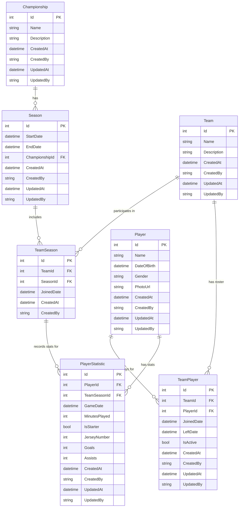

# Player Statistics Requirements

## Overview

This document outlines the requirements and domain model for the soccer player statistics tracking functionality in the GhcSamplePs application. The system enables parents and coaches to track statistics of soccer players across teams, seasons, and championships.

## Entity Descriptions

### Championship

A championship represents a league or organization that hosts soccer competitions.

**Properties:**
- **Name** (required): The name of the championship (e.g., "AYSO Region 56", "City Youth League")
- **Description** (optional): Additional details about the championship
- **CreatedAt**: Timestamp when the championship was created
- **CreatedBy**: User identifier who created the championship
- **UpdatedAt**: Timestamp when the championship was last modified
- **UpdatedBy**: User identifier who last modified the championship

### Season

A season represents a time frame within a championship during which games are played. The season is identified by its start and end dates rather than having an explicit name (e.g., dates might imply "School Championship 2025").

**Properties:**
- **StartDate** (required): The beginning date of the season
- **EndDate** (required): The ending date of the season
- **ChampionshipId** (required): Reference to the parent championship
- **CreatedAt**: Timestamp when the season was created
- **CreatedBy**: User identifier who created the season
- **UpdatedAt**: Timestamp when the season was last modified
- **UpdatedBy**: User identifier who last modified the season

**Business Rules:**
- A season must belong to exactly one championship
- A season can have multiple teams participating

### Team

A team represents a group of players that compete together.

**Properties:**
- **Name** (required): The team name
- **Description** (optional): Additional details about the team
- **CreatedAt**: Timestamp when the team was created
- **CreatedBy**: User identifier who created the team
- **UpdatedAt**: Timestamp when the team was last modified
- **UpdatedBy**: User identifier who last modified the team

**Business Rules:**
- A team can participate in multiple seasons (even across different championships)
- A team can have multiple players on its roster
- The relationship between teams and seasons is tracked through the TeamSeason join table

### Player

A player represents an individual soccer player.

**Properties:**
- **Name** (required): The player's full name
- **DateOfBirth** (required): The player's date of birth
- **Gender** (optional): The player's gender
- **PhotoUrl** (optional): URL or path to the player's photo
- **CreatedAt**: Timestamp when the player was created
- **CreatedBy**: User identifier who created the player
- **UpdatedAt**: Timestamp when the player was last modified
- **UpdatedBy**: User identifier who last modified the player

**Business Rules:**
- A player can be on multiple teams simultaneously
- A player can move between teams within or across seasons
- The relationship between players and teams is tracked through the TeamPlayer join table

### TeamSeason (Join Table)

This join table manages the many-to-many relationship between teams and seasons.

**Properties:**
- **TeamId** (required): Reference to the team
- **SeasonId** (required): Reference to the season
- **JoinedDate**: When the team joined the season
- **CreatedAt**: Timestamp when the record was created
- **CreatedBy**: User identifier who created the record

**Purpose:**
- Allows a team to participate in multiple seasons
- Tracks which teams are playing in which seasons

### TeamPlayer (Join Table)

This join table manages the many-to-many relationship between teams and players, with temporal tracking.

**Properties:**
- **TeamId** (required): Reference to the team
- **PlayerId** (required): Reference to the player
- **JoinedDate** (required): When the player joined the team
- **LeftDate** (optional): When the player left the team
- **IsActive**: Whether the player is currently active on the team
- **CreatedAt**: Timestamp when the record was created
- **CreatedBy**: User identifier who created the record
- **UpdatedAt**: Timestamp when the record was last modified
- **UpdatedBy**: User identifier who last modified the record

**Purpose:**
- Allows a player to be on multiple teams
- Tracks player roster history and movements between teams

### PlayerStatistic

Player statistics capture game-level performance data for a player on a specific team.

**Properties:**
- **PlayerId** (required): Reference to the player
- **TeamSeasonId** (required): Reference to the team-season (important for tracking stats in the correct season/team context)
- **GameDate** (required): The date the game was played
- **MinutesPlayed** (required): Number of minutes the player was on the field
- **IsStarter**: Whether the player started the game
- **JerseyNumber** (required): The jersey number worn during the game
- **Goals** (required): Number of goals scored
- **Assists** (required): Number of assists made
- **CreatedAt**: Timestamp when the statistic was created
- **CreatedBy**: User identifier who created the statistic
- **UpdatedAt**: Timestamp when the statistic was last modified
- **UpdatedBy**: User identifier who last modified the statistic

**Business Rules:**
- Statistics are tied to both a player AND a team-season combination
- This ensures stats are recorded in the correct seasonal context
- Allows accurate historical tracking when players move between teams or when teams play in different seasons
- Each statistic record represents performance in a single game

## Entity Relationship Diagram

## Key Relationships Summary

### One-to-Many Relationships
- **Championship → Season**: One championship contains many seasons
- **Player → PlayerStatistic**: One player has many statistics records
- **TeamSeason → PlayerStatistic**: One team-season combination has many statistics records

### Many-to-Many Relationships
- **Team ↔ Season** (via TeamSeason): 
  - A team can play in multiple seasons
  - A season can have multiple teams
  
- **Team ↔ Player** (via TeamPlayer):
  - A team can have multiple players on its roster
  - A player can be on multiple teams simultaneously
  - Includes temporal tracking (JoinedDate, LeftDate, IsActive)

## Business Rules & Constraints

1. **Championship Management**
   - Championships are the top-level organizational structure
   - Must have a unique name within the system

2. **Season Management**
   - Seasons are defined by date ranges within a championship
   - StartDate must be before EndDate
   - Seasons within the same championship should not overlap (business logic validation)

3. **Team Management**
   - Teams can participate across multiple seasons and championships
   - Team names should be unique within a season (business logic validation)

4. **Player Management**
   - Players are independent entities that can join multiple teams
   - DateOfBirth is used to calculate age and eligibility
   - Gender and Photo are optional for privacy considerations

5. **Player Statistics**
   - Statistics must reference both the player and the team-season combination
   - This ensures stats are recorded in the correct seasonal and team context
   - Accurate historical tracking is maintained when players transfer teams or when teams play in different seasons
   - GameDate should fall within the referenced season's date range (business logic validation)
   - MinutesPlayed cannot exceed regulation game time (business logic validation)
   - Goals and Assists must be non-negative numbers

6. **Roster Management**
   - TeamPlayer tracks the history of player-team associations
   - IsActive flag indicates current roster status
   - LeftDate is set when a player leaves a team
   - A player can have multiple active TeamPlayer records (multiple teams)

## Use Cases

### Primary User Workflows

1. **Create Championship Structure**
   - Admin creates a new championship
   - Admin creates seasons within the championship
   - Teams register to participate in seasons

2. **Manage Team Rosters**
   - Coach/admin creates a team
   - Coach adds players to the team roster
   - System tracks join dates and active status
   - Coach can move players between teams

3. **Record Game Statistics**
   - After each game, coach selects the team-season context
   - Coach enters the game date
   - Coach records statistics for each player who participated
   - System links statistics to both player and team-season
   - Statistics include: minutes played, starter status, jersey number, goals, assists

4. **View Player Performance**
   - Parents/players view individual player statistics
   - Statistics can be filtered by:
     - Specific team
     - Specific season
     - Specific team-season combination
     - Date range
     - Career totals across all teams/seasons

5. **Track Player Movement**
   - System maintains history when players change teams
   - Statistics remain associated with the team-season at time of recording
   - Complete player history is preserved across all teams and seasons
   - Stats are always tied to the specific season context, preventing cross-season confusion

## Data Validation Requirements

### Championship
- Name: Required, max 200 characters
- Description: Optional, max 1000 characters

### Season
- StartDate: Required, must be a valid date
- EndDate: Required, must be after StartDate
- ChampionshipId: Required, must reference existing championship

### Team
- Name: Required, max 200 characters
- Description: Optional, max 1000 characters

### Player
- Name: Required, max 200 characters
- DateOfBirth: Required, must be a valid date, should be in the past
- Gender: Optional, max 50 characters
- PhotoUrl: Optional, max 500 characters, must be valid URL format if provided

### PlayerStatistic
- PlayerId: Required, must reference existing player
- TeamSeasonId: Required, must reference existing team-season
- GameDate: Required, must be a valid date, should fall within the season's date range
- MinutesPlayed: Required, must be >= 0
- IsStarter: Required boolean
- JerseyNumber: Required, must be > 0
- Goals: Required, must be >= 0
- Assists: Required, must be >= 0

## Future Considerations

While not in the initial scope, these features may be added later:

- **Game Entity**: Track complete game details (opponent, score, location)
- **Additional Statistics**: Shots on goal, saves (for goalies), fouls, cards
- **Practice Tracking**: Attendance and performance in practice sessions
- **Parent/Guardian Association**: Link players to parent users for access control
- **Coach Assignment**: Formal coach-to-team relationships
- **User Roles & Permissions**: Fine-grained access control (parents see only their players, coaches see their teams)
- **Aggregate Reports**: Season summaries, career statistics, team performance analytics
- **Photo Management**: Azure Blob Storage integration for player photos
