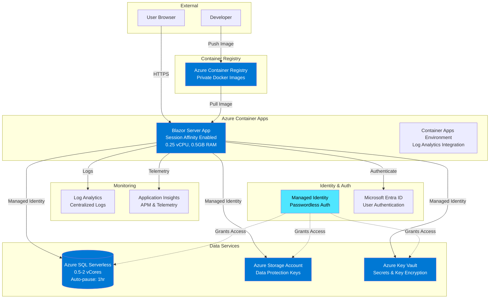

# Infrastructure as Code (IaC) - Azure Deployment

> **Blazor Server Application Deployment to Azure Container Apps with SQL Server**

This directory contains all Infrastructure as Code (IaC) artifacts for deploying the GhcSamplePs Blazor Server application to Microsoft Azure using modern cloud-native services.

[](https://azure.microsoft.com/products/container-apps)
[](https://learn.microsoft.com/azure/azure-resource-manager/bicep/)
[](https://dotnet.microsoft.com/)

---

## 📋 Table of Contents

- [Overview](#overview)
- [Architecture](#architecture)
- [Prerequisites](#prerequisites)
- [Directory Structure](#directory-structure)
- [Quick Start](#quick-start)
- [Deployment Guide](#deployment-guide)
- [Configuration](#configuration)
- [Cost Estimation](#cost-estimation)
- [Security](#security)
- [Monitoring & Observability](#monitoring--observability)
- [Troubleshooting](#troubleshooting)
- [Production Deployment](#production-deployment)

---

## Overview

### What This Deploys

This infrastructure deploys a complete, production-ready Blazor Server application stack on Azure with:

- **Azure Container Apps** - Serverless container hosting with scale-to-zero capability
- **Azure SQL Database (Serverless)** - Auto-pausing SQL database with Managed Identity authentication
- **Azure Key Vault** - Secrets management and Data Protection key encryption
- **Azure Storage Account** - Persistent storage for ASP.NET Core Data Protection keys
- **Azure Container Registry** - Private Docker image repository
- **Log Analytics + Application Insights** - Comprehensive monitoring and diagnostics

### Architecture Highlights

✅ **Passwordless Authentication** - Managed Identity for all Azure service connections  
✅ **Cost-Optimized** - Scale-to-zero containers, auto-pausing SQL, serverless compute  
✅ **Secure by Default** - HTTPS-only, RBAC authorization, encrypted secrets  
✅ **Blazor Server Ready** - Session affinity, multi-instance Data Protection  
✅ **GDPR Compliant** - Canada Central region, audit logging, encryption at rest/transit  

### Environment Configuration

**Current Configuration: Development Environment**

| Component | Configuration | Purpose |
|-----------|--------------|---------|
| Environment | Development | Cost-optimized testing and validation |
| Region | Canada Central | GDPR adequacy, data residency |
| Container Apps | 0.25 vCPU, 0.5GB RAM | Minimal resources for dev workload |
| Replicas | Min: 0, Max: 1 | Scale-to-zero for cost savings |
| SQL Database | Serverless (0.5-2 vCores) | Auto-pause after 1hr inactivity |
| Monthly Cost | **$7-35/month** | Variable based on usage |

---

## Architecture

### High-Level Architecture Diagram



### Key Architectural Decisions

#### 1. **Managed Identity (Passwordless)**
- No credentials stored in code or configuration
- Automatic token management by Azure
- Follows Microsoft security best practices
- Uses `DefaultAzureCredential` - works locally and in Azure

#### 2. **Blazor Server Session Affinity**
- Sticky sessions route users to same container instance
- Maintains SignalR connection state
- No external backplane (Azure SignalR Service) needed

#### 3. **Data Protection Multi-Instance**
- Keys persisted in Azure Blob Storage
- Keys encrypted with Azure Key Vault
- Enables seamless scaling across container replicas

#### 4. **Infrastructure as Code (Bicep)**
- Modular, reusable templates
- Type-safe with IntelliSense support
- Native Azure integration
- Version controlled and auditable

---

## Prerequisites

### Required Tools

| Tool | Version | Purpose | Installation |
|------|---------|---------|--------------|
| **Azure CLI** | 2.50+ | Azure resource management | [Install Guide](https://learn.microsoft.com/cli/azure/install-azure-cli) |
| **Docker** | 20.10+ | Container image building | [Install Guide](https://docs.docker.com/get-docker/) |
| **Bicep CLI** | 0.20+ | Infrastructure deployment | Included with Azure CLI |
| **.NET SDK** | 10.0+ | Application compilation | [Download](https://dotnet.microsoft.com/download/dotnet/10.0) |
| **PowerShell** | 7.0+ | Deployment scripts | [Install Guide](https://learn.microsoft.com/powershell/scripting/install/installing-powershell) |

### Azure Subscription Requirements

- Active Azure subscription
- Contributor or Owner role on resource group
- Ability to create service principals (for Managed Identity)
- Microsoft Entra ID (Azure AD) access for app registration

### Verify Prerequisites

```powershell
# Check Azure CLI version
az --version

# Check Docker
docker --version

# Check .NET SDK
dotnet --version

# Check Bicep
az bicep version

# Login to Azure
az login
```

---

## Directory Structure

```
infra/
├── main.bicep                  # Main orchestration template
├── main.bicepparam            # Development environment parameters
├── main.json                  # Compiled ARM template (auto-generated)
├── README.md                  # This file
│
├── modules/                   # Modular Bicep templates
│   ├── alerts.bicep           # Monitoring alerts for auth events
│   ├── containerapp.bicep     # Container Apps Environment + App
│   ├── containerregistry.bicep # Azure Container Registry
│   ├── keyvault.bicep         # Azure Key Vault
│   ├── monitoring.bicep       # Log Analytics + App Insights
│   ├── sql.bicep              # Azure SQL Server + Database
│   └── storage.bicep          # Storage Account + Blob Container
│
└── scripts/                   # PowerShell deployment automation
    ├── deploy-infra.ps1       # Deploy/update infrastructure
    ├── build-push-image.ps1   # Build and push Docker image
    └── configure-permissions.ps1 # SQL permissions helper
```

### Module Responsibilities

| Module | Resources Created | Purpose |
|--------|-------------------|---------|
| **alerts.bicep** | Alert Rules, Action Group | Authentication and authorization failure alerts |
| **containerapp.bicep** | Container Apps Environment, Container App | Hosts Blazor Server app with session affinity |
| **containerregistry.bicep** | Container Registry | Private Docker image repository |
| **keyvault.bicep** | Key Vault | Secrets management, Data Protection encryption |
| **monitoring.bicep** | Log Analytics, Application Insights | Logging and APM telemetry |
| **sql.bicep** | SQL Server, SQL Database, Firewall Rules | Serverless database with Managed Identity |
| **storage.bicep** | Storage Account, Blob Container | Data Protection key persistence |

---

## Quick Start

### 1. Configure Parameters

Edit `main.bicepparam` and replace placeholder values:

```bicep
// Your Entra ID credentials
param sqlAdminEntraId = 'your-email@domain.com'
param sqlAdminObjectId = 'your-entra-object-id'  // Get from Azure Portal

// Your app registration (from appsettings.json)
param entraIdClientId = 'your-app-client-id'
param entraIdTenantId = 'your-tenant-id'

// Optional: Email for monitoring alerts (leave empty to skip alerts)
param alertEmailAddress = 'admin@contoso.com'
```

#### How to Get Required Values

**Entra ID Object ID:**
```powershell
az ad signed-in-user show --query id -o tsv
```

**App Registration Values:**
- Found in `src/GhcSamplePs.Web/appsettings.json`
- Or Azure Portal → App Registrations → Your App

### 2. Deploy Infrastructure

```powershell
# From repository root
cd infra

# Deploy to Azure
.\scripts\deploy-infra.ps1 -ResourceGroupName "rg-ghcsampleps-dev"
```

This creates:
- Resource Group (if not exists)
- All Azure resources defined in Bicep templates
- Managed Identity with RBAC assignments

**Deployment time:** ~5-8 minutes

### 3. Configure SQL Permissions

After infrastructure deployment, grant Managed Identity SQL access:

```powershell
.\scripts\configure-permissions.ps1 `
    -ResourceGroupName "rg-ghcsampleps-dev" `
    -ContainerAppName "ghcsampleps-dev-app" `
    -SqlServerName "ghcsampleps-dev-sql" `
    -DatabaseName "ghcsampleps"
```

This displays SQL commands to run as Entra ID admin.

### 4. Build and Push Docker Image

```powershell
# Build and push to Azure Container Registry
.\scripts\build-push-image.ps1 -RegistryName "acrghcsamplepsdev"
```

### 5. Update Container App

```powershell
# Update Container App with new image
az containerapp update `
    --name ghcsampleps-dev-app `
    --resource-group rg-ghcsampleps-dev `
    --image acrghcsamplepsdev.azurecr.io/ghcsampleps-web:latest
```

### 6. Update Entra ID Redirect URIs

1. Go to Azure Portal → App Registrations
2. Find your application
3. Add new redirect URI: `https://<container-app-url>/signin-oidc`
4. Add logout URI: `https://<container-app-url>/signout-callback-oidc`

**Get Container App URL:**
```powershell
az containerapp show `
    --name ghcsampleps-dev-app `
    --resource-group rg-ghcsampleps-dev `
    --query properties.configuration.ingress.fqdn -o tsv
```

---

## Deployment Guide

### Detailed Deployment Steps

#### Step 1: Validate Bicep Templates

```powershell
# Validate syntax
az bicep build --file main.bicep

# Lint for best practices
az bicep lint --file main.bicep

# Preview changes (What-If)
az deployment group what-if `
    --resource-group rg-ghcsampleps-dev `
    --template-file main.bicep `
    --parameters main.bicepparam
```

#### Step 2: Create Resource Group

```powershell
az group create `
    --name rg-ghcsampleps-dev `
    --location canadacentral
```

#### Step 3: Deploy Infrastructure

**Option A: Using PowerShell Script (Recommended)**

```powershell
.\scripts\deploy-infra.ps1 `
    -ResourceGroupName "rg-ghcsampleps-dev" `
    -Location "canadacentral" `
    -ParameterFile "./main.bicepparam"
```

**Option B: Using Azure CLI Directly**

```powershell
az deployment group create `
    --name "ghcsampleps-$(Get-Date -Format 'yyyyMMddHHmmss')" `
    --resource-group rg-ghcsampleps-dev `
    --template-file main.bicep `
    --parameters main.bicepparam `
    --verbose
```

#### Step 4: Verify Deployment

```powershell
# Check deployment status
az deployment group list `
    --resource-group rg-ghcsampleps-dev `
    --output table

# List created resources
az resource list `
    --resource-group rg-ghcsampleps-dev `
    --output table

# Get deployment outputs
az deployment group show `
    --name <deployment-name> `
    --resource-group rg-ghcsampleps-dev `
    --query properties.outputs
```

#### Step 5: Configure SQL Database Access

Run the generated SQL commands from `configure-permissions.ps1`:

```sql
-- Connect to ghcsampleps database using Azure Data Studio or SQL Server Management Studio
-- Use Entra ID authentication

CREATE USER [ghcsampleps-dev-app] FROM EXTERNAL PROVIDER;
ALTER ROLE db_datareader ADD MEMBER [ghcsampleps-dev-app];
ALTER ROLE db_datawriter ADD MEMBER [ghcsampleps-dev-app];
ALTER ROLE db_ddladmin ADD MEMBER [ghcsampleps-dev-app];
GO
```

#### Step 6: Build Application Image

From repository root:

```powershell
# Build Docker image locally
docker build -t ghcsampleps-web:latest -f src/GhcSamplePs.Web/Dockerfile .

# Test locally (optional)
docker run -p 8080:8080 ghcsampleps-web:latest

# Push to Azure Container Registry
.\infra\scripts\build-push-image.ps1 -RegistryName "acrghcsamplepsdev"
```

#### Step 7: Validate Application

```powershell
# Get application URL
$appUrl = az containerapp show `
    --name ghcsampleps-dev-app `
    --resource-group rg-ghcsampleps-dev `
    --query properties.configuration.ingress.fqdn -o tsv

Write-Host "Application URL: https://$appUrl"

# Test health endpoint
Invoke-WebRequest -Uri "https://$appUrl/health" -UseBasicParsing
```

---

## Configuration

### Environment Variables

Container Apps automatically inject these environment variables:

| Variable | Source | Purpose |
|----------|--------|---------|
| `ConnectionStrings__DefaultConnection` | SQL Module Output | SQL connection string with Managed Identity |
| `AzureAd__TenantId` | Parameter | Entra ID tenant ID |
| `AzureAd__ClientId` | Parameter | Entra ID client ID |
| `KeyVault__VaultUri` | Key Vault Output | Key Vault endpoint for Data Protection |
| `Storage__BlobEndpoint` | Storage Output | Blob endpoint for Data Protection keys |

### Scaling Configuration

Default development settings (can be modified in `modules/containerapp.bicep`):

```bicep
scale: {
  minReplicas: 0              // Scale to zero when idle
  maxReplicas: 1              // Maximum 1 instance for dev
  rules: [
    {
      name: 'http-rule'
      http: {
        metadata: {
          concurrentRequests: '10'
        }
      }
    }
  ]
}
```

### Resource Naming Convention

All resources follow the pattern: `{appName}-{resource}-{environment}`

Examples:
- SQL Server: `ghcsampleps-dev-sql`
- Container App: `ghcsampleps-dev-app`
- Key Vault: `ghcsamplepsdevkv` (truncated to meet 24-char limit)
- Storage Account: `stghcsamplepsdev` (alphanumeric only)

---

## Cost Estimation

### Development Environment (Current Configuration)

| Service | Configuration | Monthly Cost |
|---------|--------------|--------------|
| **Container Apps** | 0.25 vCPU, 0.5GB RAM, scale-to-zero | $0-5 |
| **SQL Database Serverless** | 0.5-2 vCores, auto-pause 1hr | $5-15 |
| **Storage Account** | Standard LRS, <1GB data | $0.50 |
| **Key Vault** | Standard tier, ~10 operations/day | $0.50 |
| **Container Registry** | Basic tier | $5 |
| **Log Analytics** | Free tier (500MB/day) | $0 |
| **Application Insights** | 10% sampling, <1GB/month | $0-2 |
| **Networking** | Minimal egress | $1-2 |
| **Total** | | **$7-35/month** |

### Cost Breakdown by Usage Pattern

**Idle (Weekends, Nights, Auto-Paused):** ~$7-10/month
- SQL paused after 1hr inactivity: $0/hr
- Container scaled to zero: $0/hr
- Fixed costs: Storage ($0.50) + Key Vault ($0.50) + ACR ($5)

**Active Development (8hrs/day, 5 days/week):** ~$25-35/month
- SQL active ~40hrs/month: $10-15
- Container running ~40hrs/month: $3-5
- Monitoring and logs: $2-3

### Cost Optimization Features

✅ **Scale-to-Zero Containers** - No compute cost when idle  
✅ **SQL Auto-Pause** - Database pauses after 1 hour inactivity  
✅ **Free Tier Monitoring** - 500MB/day Log Analytics ingestion  
✅ **Sampled App Insights** - 10% telemetry sampling reduces ingestion  
✅ **Single Replica** - No redundancy overhead in development  
✅ **Minimal Resources** - Smallest container sizes (0.25 vCPU)  

### Cost Monitoring

```powershell
# View current month costs by resource
az consumption usage list `
    --query "[?contains(instanceName, 'ghcsampleps')].{Resource:instanceName, Cost:pretaxCost, Currency:currency}" `
    --output table

# Set budget alert
az consumption budget create `
    --budget-name ghcsampleps-dev-budget `
    --amount 50 `
    --time-grain Monthly `
    --resource-group rg-ghcsampleps-dev
```

---

## Security

### Managed Identity (Passwordless Authentication)

**How It Works:**

1. Container App assigned System Managed Identity at creation
2. RBAC roles granted to identity:
   - **SQL Database:** `db_datareader`, `db_datawriter`, `db_ddladmin`
   - **Key Vault:** Key Vault Secrets User, Key Vault Crypto User
   - **Storage Account:** Storage Blob Data Contributor
   - **Container Registry:** AcrPull
3. Application uses `DefaultAzureCredential`:
   - Locally: Uses Azure CLI or Visual Studio credentials
   - In Azure: Uses Managed Identity automatically

**Code Example:**

```csharp
// In Program.cs - works both locally and in Azure
var azureCredential = new DefaultAzureCredential();

builder.Services.AddDataProtection()
    .PersistKeysToAzureBlobStorage(
        new Uri($"{blobEndpoint}/dataprotection-keys/keys.xml"),
        azureCredential)
    .ProtectKeysWithAzureKeyVault(
        new Uri($"{vaultUri}/keys/dataprotection"),
        azureCredential);
```

### Security Best Practices Implemented

✅ **HTTPS-Only Communication** - All endpoints force HTTPS  
✅ **TLS 1.2 Minimum** - Enforced on all services  
✅ **No Credentials in Code** - Managed Identity eliminates secrets  
✅ **RBAC Authorization** - Least privilege access model  
✅ **Encrypted Secrets** - Key Vault with soft delete + purge protection  
✅ **Encrypted Data Protection Keys** - Keys encrypted with Key Vault  
✅ **Non-Root Container User** - Docker runs as unprivileged user  
✅ **Private Container Registry** - Images not publicly accessible  
✅ **Entra ID Authentication** - User authentication via Azure AD  
✅ **SQL Firewall Rules** - Only Azure services allowed  

### Secrets Management

**Never Store Secrets In:**
- ❌ Source code
- ❌ appsettings.json (except Development)
- ❌ Environment variables in plain text
- ❌ Container image layers

**Always Use:**
- ✅ Azure Key Vault for sensitive configuration
- ✅ Container Apps secrets (encrypted at rest)
- ✅ Managed Identity for service-to-service auth
- ✅ User Secrets for local development

### Network Security

**Current Configuration: Basic (Public Ingress)**

- Public HTTPS ingress with Entra ID authentication
- Azure SQL firewall allows Azure services only
- Can upgrade to VNet integration later (+$150/month)

**Future Enhancements:**
- Private endpoints for Key Vault, Storage, SQL
- VNet integration for Container Apps
- Network Security Groups (NSGs)
- Web Application Firewall (WAF)

---

## Monitoring & Observability

### Authentication Monitoring

The application includes comprehensive authentication and authorization monitoring. For detailed information about:
- Custom authentication event tracking
- Alert rule configuration
- Kusto queries for authentication analysis
- Dashboard setup

See the **[Monitoring Guide](../docs/Monitoring_Guide.md)**.

### Alert Rules

Three alert rules are deployed when `alertEmailAddress` is provided:

| Alert | Severity | Trigger |
|-------|----------|---------|
| Authentication Failures | Warning | >5 failures in 15 minutes |
| Authorization Failures | Warning | >10 failures in 15 minutes |
| Entra ID Connectivity | Error | Any connectivity failure |

### Log Analytics Workspace

**Configuration:**
- SKU: PerGB2018 (free tier)
- Retention: 30 days
- Daily quota: 500MB (free tier limit)

**Querying Logs:**

```kusto
// Container app logs (last 1 hour)
ContainerAppConsoleLogs_CL
| where TimeGenerated > ago(1h)
| where ContainerAppName_s == "ghcsampleps-dev-app"
| project TimeGenerated, Log_s
| order by TimeGenerated desc

// Application errors
AppTraces
| where TimeGenerated > ago(24h)
| where SeverityLevel >= 3  // Error and above
| project TimeGenerated, Message, SeverityLevel
| order by TimeGenerated desc

// Authentication failures (custom events)
customEvents
| where name == "AuthenticationFailure"
| where timestamp > ago(24h)
| project timestamp, Reason = tostring(customDimensions.Reason)
| order by timestamp desc
```

### Application Insights

**Configuration:**
- Sampling: 10% (reduces cost)
- Ingestion mode: LogAnalytics
- Smart detection enabled
- Custom events: Authentication telemetry

**Key Metrics to Monitor:**

```powershell
# Get Application Insights key
$appInsightsKey = az monitor app-insights component show `
    --app ghcsampleps-dev-ai `
    --resource-group rg-ghcsampleps-dev `
    --query instrumentationKey -o tsv

# Query metrics (requires Application Insights extension)
az monitor app-insights metrics show `
    --app ghcsampleps-dev-ai `
    --resource-group rg-ghcsampleps-dev `
    --metric requests/count `
    --aggregation count
```

### Health Checks

The application exposes a health endpoint:

```bash
# Manual health check
curl https://<app-url>/health

# Container Apps startup probe
GET /health
Expected: 200 OK
```

**Health Check Configuration in Container App:**

```bicep
probes: [
  {
    type: 'Liveness'
    httpGet: {
      path: '/health'
      port: 8080
    }
    initialDelaySeconds: 10
    periodSeconds: 30
  }
]
```

### Monitoring Dashboard

Create a custom dashboard in Azure Portal:

1. Navigate to Azure Portal → Dashboards
2. Create new dashboard: "GhcSamplePs Development"
3. Add tiles:
   - Container App metrics (CPU, memory, requests)
   - SQL Database DTU/vCore usage
   - Application Insights overview
   - Log Analytics query results
   - Authentication success/failure metrics

---

## Troubleshooting

### Common Issues

#### 1. Deployment Fails - Key Vault Name Too Long

**Error:** `BCP335: Key vault name exceeds 24 characters`

**Solution:** Already fixed in `main.bicep` with truncation logic:
```bicep
var keyVaultName = '${take(appName, 18)}${environment}kv'
```

#### 2. Container App Can't Connect to SQL

**Symptoms:**
- SQL connection timeouts
- Authentication errors

**Solutions:**

```powershell
# Verify firewall rules
az sql server firewall-rule list `
    --server ghcsampleps-dev-sql `
    --resource-group rg-ghcsampleps-dev

# Verify Managed Identity SQL permissions
# Connect to SQL with Entra ID and run:
SELECT name, type_desc FROM sys.database_principals 
WHERE name = 'ghcsampleps-dev-app';

# Check container app identity
az containerapp show `
    --name ghcsampleps-dev-app `
    --resource-group rg-ghcsampleps-dev `
    --query identity
```

#### 3. Container App Fails to Start

**Check logs:**

```powershell
# Stream logs in real-time
az containerapp logs show `
    --name ghcsampleps-dev-app `
    --resource-group rg-ghcsampleps-dev `
    --follow

# Check container app revisions
az containerapp revision list `
    --name ghcsampleps-dev-app `
    --resource-group rg-ghcsampleps-dev `
    --output table
```

#### 4. SQL Database Paused - Slow First Request

**Expected Behavior:**
- SQL Serverless auto-pauses after 1 hour inactivity
- First request after pause takes ~1-2 seconds to resume
- Subsequent requests are normal speed

**This is by design** to save costs in development.

#### 5. Image Pull Errors from ACR

**Error:** `Failed to pull image: unauthorized`

**Solution:**

```powershell
# Verify ACR RBAC assignment
az role assignment list `
    --assignee <managed-identity-principal-id> `
    --scope /subscriptions/<sub-id>/resourceGroups/rg-ghcsampleps-dev/providers/Microsoft.ContainerRegistry/registries/acrghcsamplepsdev

# Verify ACR credentials
az acr login --name acrghcsamplepsdev

# Manually assign AcrPull role if missing
az role assignment create `
    --assignee <managed-identity-principal-id> `
    --role AcrPull `
    --scope /subscriptions/<sub-id>/resourceGroups/rg-ghcsampleps-dev/providers/Microsoft.ContainerRegistry/registries/acrghcsamplepsdev
```

### Diagnostic Commands

```powershell
# Get all container app logs (last 1 hour)
az monitor log-analytics query `
    --workspace <workspace-id> `
    --analytics-query "ContainerAppConsoleLogs_CL | where TimeGenerated > ago(1h)" `
    --output table

# Check container app revision health
az containerapp revision show `
    --name ghcsampleps-dev-app `
    --resource-group rg-ghcsampleps-dev `
    --revision <revision-name> `
    --query properties.healthState

# Test SQL connectivity from Azure Cloud Shell
sqlcmd -S ghcsampleps-dev-sql.database.windows.net -d ghcsampleps -G

# Verify Key Vault access
az keyvault secret list --vault-name ghcsamplepsdevkv
```

---

## Production Deployment

### Transitioning to Production

When ready to deploy a production environment, create a new parameter file:

**`main.bicepparam.prod`:**

```bicep
using './main.bicep'

param location = 'canadacentral'
param environment = 'prod'
param appName = 'ghcsampleps'

// Production-specific changes:
// 1. Update Entra ID credentials for production
// 2. Different SQL admin if needed
// 3. Consider zone redundancy
```

### Production Configuration Changes

Update `modules/containerapp.bicep` for production:

```bicep
// Change scale configuration
scale: {
  minReplicas: 2              // Always-on, no cold start
  maxReplicas: 10             // Higher scale limit
  rules: [
    {
      name: 'http-rule'
      http: {
        metadata: {
          concurrentRequests: '50'  // Higher concurrency
        }
      }
    }
  ]
}

// Increase resources
resources: {
  cpu: json('0.5')            // 0.25 → 0.5 vCPU
  memory: '1Gi'               // 0.5GB → 1GB
}
```

Update `modules/sql.bicep` for production:

```bicep
// Change to provisioned compute for predictable performance
sku: {
  name: 'S2'                  // Standard tier
  tier: 'Standard'
  capacity: 50                // 50 DTUs
}
// Remove auto-pause configuration
```

### Production Checklist

- [ ] Enable zone redundancy for Container Apps Environment
- [ ] Upgrade SQL to provisioned compute (S2 or higher)
- [ ] Increase container resources (0.5 vCPU, 1GB RAM)
- [ ] Set min replicas to 2+ (no scale-to-zero)
- [ ] Configure Application Insights for 100% sampling
- [ ] Enable VNet integration for internal traffic
- [ ] Add private endpoints for SQL, Key Vault, Storage
- [ ] Configure Azure Front Door or CDN
- [ ] Enable Web Application Firewall (WAF)
- [ ] Set up automated backups and disaster recovery
- [ ] Create CI/CD pipeline (GitHub Actions)
- [ ] Configure production monitoring alerts
- [ ] Update Entra ID with production redirect URIs
- [ ] Review and update RBAC permissions
- [ ] Enable Azure DDoS Protection
- [ ] Configure budget alerts

### Estimated Production Costs

**Monthly:** $125-235/month (single region)

- Container Apps (2-10 replicas): $30-80
- SQL Standard S2: $75
- Storage/Key Vault: $2
- Monitoring (full sampling): $10-30
- Networking: $5-10
- Container Registry: $5
- **Optional:** VNet Integration (+$150), WAF (+$300), Multi-Region (2-3x total)

---

## Additional Resources

### Documentation

- [Azure Container Apps Documentation](https://learn.microsoft.com/azure/container-apps/)
- [Blazor Server Hosting on Azure](https://learn.microsoft.com/aspnet/core/blazor/host-and-deploy/server)
- [Azure SQL Managed Identity Auth](https://learn.microsoft.com/azure/azure-sql/database/authentication-aad-configure)
- [Bicep Language Reference](https://learn.microsoft.com/azure/azure-resource-manager/bicep/)
- [Azure Well-Architected Framework](https://learn.microsoft.com/azure/well-architected/)

### Project-Specific Documentation

- [High-Level Architecture](../docs/infra/high-level.md) - Complete architecture decisions and rationale
- [Implementation Plan](../docs/infra/implementation-plan.md) - Detailed implementation specifications
- [Infrastructure Verification Checklist](../docs/Infrastructure_Verification_Checklist.md) - Pre-deployment validation

### Support

- **Issues:** [GitHub Issues](https://github.com/ricardocovo/ghc-sample-ps/issues)
- **Azure Support:** [Azure Portal Support](https://portal.azure.com/#blade/Microsoft_Azure_Support/HelpAndSupportBlade)
- **Community:** [Azure Container Apps Discussions](https://github.com/microsoft/azure-container-apps/discussions)

---

## License

This infrastructure code is part of the GhcSamplePs project. See the main repository LICENSE file for details.

---

**Last Updated:** December 3, 2025  
**Infrastructure Version:** 1.0.0  
**Environment:** Development  
**Deployment Status:** ✅ Validated & Ready
